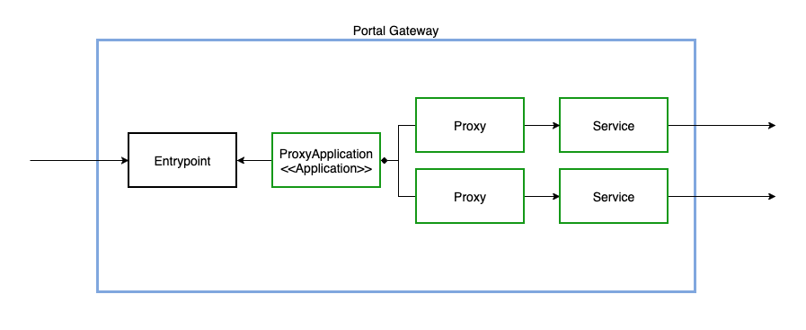
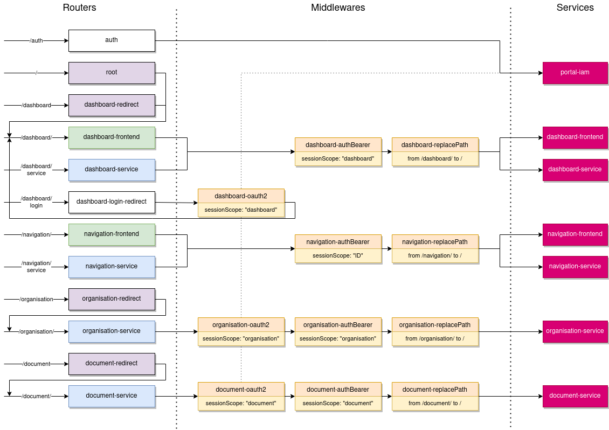
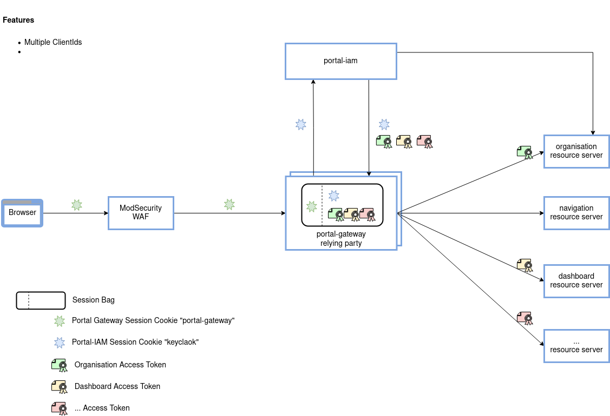

# Portal Gateway

Der Portal Gateway Server agiert als Reverse Proxy für alle Request des Portals.



Für die Konfiguration des Portal Gateway Servers wird eine JSON Datei verwendet. Diese wird in der angegebenen Reihenfolge gesucht:

1. Datei welche über die Environment Variable `PORTAL_GATEWAY_JSON` angegeben wird
2. Datei welche über das System Property `PORTAL_GATEWAY_JSON` angegeben wird
3. Datei `portal-gateway.json` im `/etc/portal-gateway/default/` Verzeichnis
4. Datei `portal-gateway.json` im aktuellen Verzeichnis (Run Configuration "PortalGateway" := ./server/portal-gateway)

## Build

```bash
./mvnw clean install
```

**Beachte**: Deine Konfiguration unter [~/.m2/settings.xml](http://maven.apache.org/settings.html#Servers) muss mindestens mit dem folgenden Inhalt existieren:

```xml
<servers>
    <server>
        <id>inventage-projectware</id>
        <username>username</username>
        <password>password</password>
    </server>
</servers>
```

(Du kannst auch [user tokens](https://help.sonatype.com/repomanager3/system-configuration/user-authentication/security-setup-with-user-tokens) verwenden, falls du keine Passwörter in Dateien speichern möchtest)

### Native Image

Um Portal-Gateway mit GraalVM zu einem native Image zu kompilieren ist ein lokales Setup nötig:

* [Installation GraalVM](https://www.graalvm.org/docs/getting-started/#install-graalvm)
* [Installation Native Image](https://www.graalvm.org/reference-manual/native-image/#install-native-image) mit `gu install native-image`

Nach `mvn clean package` wird das native Image unter `server/target/com.inventage.portal.gateway.portalgatewaylauncher` verfügbar sein.

**Beachte**: `export PATH=/path/to/<graalvm>/bin:$PATH` muss gesetzt sein, ansonsten failt der Build mit `Error creating native image [..] Property 'Args' contains invalid entry [..]`

## Launch

**Beachte**: MacOS Nutzer **müssen** Docker verwenden, um den Portal-Gateway out-of-the-box zu starten und den Docker Provider verwenden zu können. Der Grund dahinter ist, dass die Microservices hinter dem Portal-Gateway nicht auf einem Port published sind und dementsprechend nicht direkt ansprechbar sind (siehe [Docker Documentation](https://docs.docker.com/docker-for-mac/networking/#known-limitations-use-cases-and-workarounds)).

### IDE

Die Run Configuration `PortalGateway` startet den Portal Gateway Server aus der IDE. Dabei werden die beiden Property Dateien [portal-gateway.common.env](./docker-compose/src/main/resources/portal-gateway.common.env) und [portal-gateway.specific.env](./docker-compose/src/main/resources/portal-gateway.specific.env) zur Konfiguration verwendet.

Für den Start der verwendeten Backend Systeme, kann die Run Configuration `whoami: docker-compose` verwendet werden.

**Beachte**: Um die `whoami: docker-compose` Run Configuration direkt von IntelliJ zu starten, musst du den Support für [Docker in IntelliJ](https://www.jetbrains.com/help/idea/docker.html) aktivieren. Zudem muss das Plugin `net.ashald.envfile` in IntelliJ installiert werden.

(Alternativ, kannst du die Docker-Compose auch direkt von der Command Line benutzen).

### Docker

Die Run Configuration `portal-gateway: docker-compose` baut und startet den Portal Gateway Server aus der IDE in einem Docker Container. Es werden die gleichen Property Dateien wie oben verwendet.

**Wichtig**: Damit die Service Discovery von Docker Containern funktioniert, wird `/var/run/docker.sock` in der Portal-Gateway gemounted. Wichtig dabei ist, dass der `docker.sock` die Berechtigung 666 (`sudo chmod 666 /var/run/docker.sock`) hat. Dabei gibt es [einige Sicherheitsaspekte](https://cheatsheetseries.owasp.org/cheatsheets/Docker_Security_Cheat_Sheet.html#rule-1-do-not-expose-the-docker-daemon-socket-even-to-the-containers) zu beachten.

### Native Image

Die statische Konfiguration kann über eine Environment Variable oder System Property mitgegeben werden:

```bash
export PORTAL_GATEWAY_JSON=${PWD}/server/portal-gateway; server/target/com.inventage.portal.gateway.portalgatewaylauncher
```

```bash
server/target/com.inventage.portal.gateway.portalgatewaylauncher -DPORTAL_GATEWAY_JSON=${PWD}/server/portal-gateway
```

### Produktives Environment

Für den Start der produktiven Backend Systemen, kann der [Archetype](https://git.inventage.com/projects/PORTAL/repos/archetype-inventage-portal-solution) verwendet werden. Dabei müssen die Hostnamen der Backend Systemen im [portal-gateway.specific.env](./docker-compose/src/main/resources/portal-gateway.specific.env) gesetzt werden.
Zum Beispiel mit einer `artifactId` von `local-portal` kann die `portal-gateway.specific.env` so aussehen:

```
PORTAL_GATEWAY_PORTAL_IAM_HOST=local-portal-portal-iam
PORTAL_GATEWAY_PORTAL_IAM_PORT=8080

PORTAL_GATEWAY_BASE_PROXY_HOST=local-portal-base-proxy
PORTAL_GATEWAY_DASHBOARD_PROXY_HOST=local-portal-dashboard-proxy
PORTAL_GATEWAY_ORGANISATION_PROXY_HOST=local-portal-organisation-proxy
```

## Visulisierungen

## Beispielflow



### Konzept des Sessionbags


