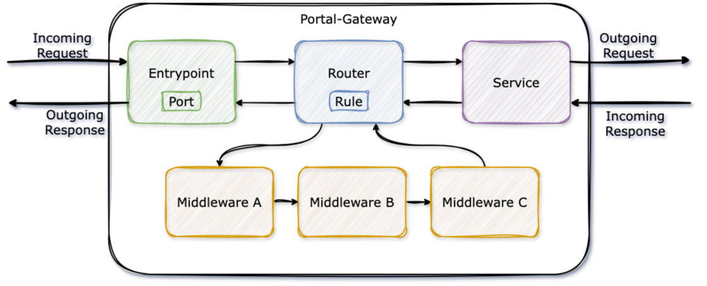

# Introduction

The Portal-Gateway acts as an reverse proxy for all requests in Uniport.

## Overview

The Portal-Gateway build on top of the concepts of `entrypoints`, `routers`, `middlewares`, `services` and `providers`:

* An `entrypoint` configures the port it is listening on
* A `router` configures a `rule` to route requests, e.g. based on the request's host or path
* A `router` may have `middlewares` to manipulate a request
* A `router` passes the request to a `service` that forward the request to the destination server
* A `provider` reads configuration, e.g. from a file, and provisions the `router`, `middlewares` and `services` accordingly.

## Configuration

The Portal-Gateway has two different types of configuration, a `static` configuration and `dynamic` configurations:

* The `static` configuration is the minimal configuration needed to start the Portal-Gateway and cannot be changed at runtime. It consists of `entrypoints` and `providers`.
* The `dynamic` configuration configures `routers`, `middlewares` and `services`. It can be dynamically updated and applied at runtime.

The simplest `provider` is the `file` provider. It reads the configuration from a JSON file and searches at the following locations:

1. File pointed at by the environment variable `PORTAL_GATEWAY_JSON`
2. File pointed at by the system property `PORTAL_GATEWAY_JSON`
3. File `portal-gateway.json` in the `/etc/portal-gateway/default/` directory
4. File `portal-gateway.json` in the current working directory
