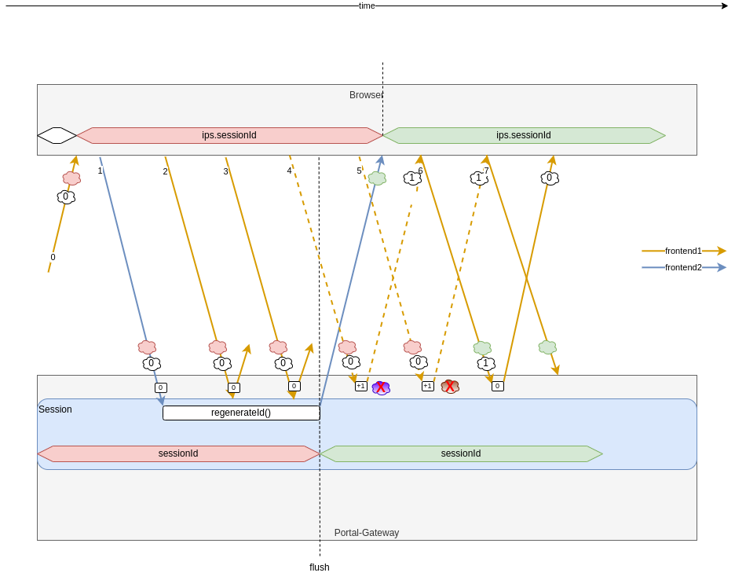
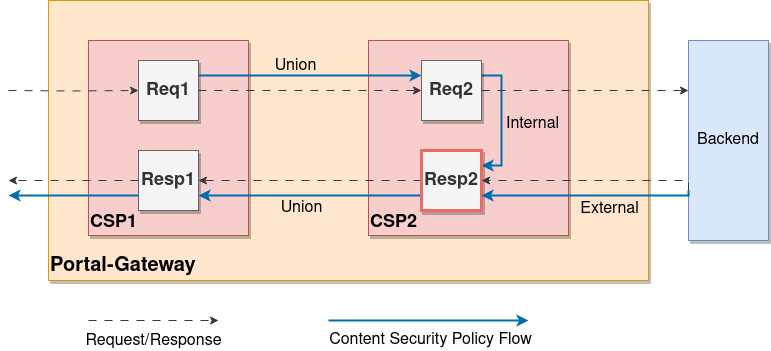

# Customization

To make new microservices accessible via the Portal-Gateway, a dedicated configuration must be created and integrated. The following sections describe the procedure for this.

## Creating a Custom Configuration

The configuration of the Portal-Gateway is twofold:

- **Static**
- **Dynamic**

The static configuration is provided in the form of a JSON file. It defines the objects for `entrypoints` and `providers`.

The second level depends on the `providers` from the static configuration. The dynamic configuration defines how the Portal-Gateway processes incoming requests.

### JSON Schema

For both static and dynamic configurations, there are JSON schemas that define the structure of the configuration. Modern IDEs (e.g., IntelliJ) can use the JSON schema to assist developers in writing and validating the configuration.

Further information on using JSON schemas can be found in the following [chapter](../05-extending-developing/index.md#json-schemas-for-configuration-files).

### Static Configuration

The JSON file for the static configuration is searched for at startup in the specified order:

1.  File specified via the Environment Variable `PORTAL_GATEWAY_JSON`
2.  File specified via the System Property `PORTAL_GATEWAY_JSON`
3.  File `portal-gateway.json` in the `/etc/portal-gateway/default/` directory
4.  File `portal-gateway.json` in the current directory (Run Configuration "PortalGateway" := ./server/portal-gateway)

??? abstract "Example of a static configuration"

    Additional configuration files can be referenced from this JSON file. For example, this configuration file uses the `file` Provider for dynamic configuration, with further files contained in the subdirectory `./dynamic-config/`.

    ```json
    {
        "entrypoints": [
            {
                "name": "http20000",
                "port": 20000,
                "middlewares": [
                {
                    "name": "customHeader",
                    "type": "headers",
                    "options": {
                        "customResponseHeaders": {
                            "customResponseHeader": "customResponseValue"
                        },
                        "customRequestHeaders": {
                            "customRequestHeader": "customRequestValue"
                        }
                    }
                }]
            }
        ],
        "providers": [
            {
                "name": "file",
                "directory": "./dynamic-config",
                "watch": false
            }
        ]
    }
    ```

    In this case, the referenced directory `./dynamic-config/` must contain at least one subdirectory (with any name). This subdirectory contains the other JSON files for configuring `routers`, `middlewares`, and `services`, e.g.:

    ```text
    portal-gateway/server/src/main/resources/
    |-- portal-gateway
    |   |-- dynamic-config
    |   |   |-- auth
    |   |   |   `-- config.json
    |   |   `-- general
    |   |       `-- config.json
    |   `-- portal-gateway.json
    ```

    If there are multiple subdirectories with JSON files, JSON arrays under the same key are concatenated instead of overwritten. This allows configurations to be clearly structured. With the folder structure from the example above, routers can be defined and used simultaneously in `auth/config.json` and `general/config.json`.

#### Entrypoints

Entrypoints are the network entry points of Portal-Gateway. They define the port where packets are received. Entrypoints are part of the Static Configuration.

| Variable | Required | Type | Description |
| --- | --- | --- | --- |
| `name` | Yes | String | Name of the entrypoint |
| `port` | Yes | Integer | Port number |
| `sessionDisabled` | No | Boolean | Disables session handling (Default: `false`). As of version `8.0.0`, this variable **MUST NOT** be set anymore. Session is not active by default, it can only be activated if the Session Middleware is explicitly declared. |
| `sessionIdleTimeout` | No | Integer | Defines after how many minutes a session is considered "idle" and removed (Default: `30`) |
| `middlewares` | No | List of [middlewares](#entry-middlewares) | Middlewares can be attached to each entrypoint, which are first processed before a request is forwarded to the route-specific middlewares. |

#### Applications

Applications define the core logic of Portal-Gateway. They define which applications listen on which ports and paths.

| Variable                    | Required | Type   | Description                                                                         |
| --------------------------- | -------- | ------ | ----------------------------------------------------------------------------------- |
| `name`                      | Yes      | String | Name of the application                                                             |
| `entrypoint`                | Yes      | String | Reference to an existing entrypoint to listen for requests                          |
| `requestSelector.urlPrefix` | Yes      | String | Path that the application listens on (TODO Status: not implemented, default is `/`) |
| `provider`                  | Yes      | String | Class name of the application that processes requests                               |

#### Providers

The Portal-Gateway can be configured via Providers.

The following Provider types are supported:

- File (name = `file`)
- Docker Container (name = `docker`)

##### File Provider

The Portal-Gateway can be configured using a JSON file via the File Provider. Configuration via a single file or multiple files is supported.

!!! hint "Keep it DRY"

    The File Provider can be used for the reuse of configurations.

| Variable | Required | Type | Default | Description |
| --- | --- | --- | --- | --- |
| `name` | Yes | String | - | Type of the Provider, here `file` |
| `filename` | Yes or `directory` | String | - | Defines the path to a configuration file |
| `directory` | Yes or `filename` | String | - | Defines the path to the directory which contains the configuration files. It is important to understand how multiple configuration files are merged: In general, with a deep-merge (recursive) JSON objects are matched within the existing structure and all matching entries are replaced. JsonArrays are treated like any other entry, i.e., completely replaced. This pattern is applied to all files that are in the same directory. For more complex configurations, we offer a merge mechanism over subdirectories. Subdirectories are largely merged in the same way as described above, with the exception of JsonArrays. JsonArrays are concatenated without duplicates. The names of the subdirectories do not matter and can be used for organizational purposes. |
| `watch` | Yes | Boolean | - | Set watch option to `true` to automatically react to file changes. |

##### Docker Provider

With Docker, Container Labels can be used to configure routing in the Portal-Gateway.

| Variable | Required | Type | Default | Description |
| --- | --- | --- | --- | --- |
| `endpoint` | No | String | `unix:///var/run/docker.sock` | The Portal-Gateway needs access to the Docker Socket to read the dynamic configuration. The Docker API endpoint can be defined via this variable. |
| `exposedByDefault` | No | Boolean | `true` | Exposes the container by default via the Portal-Gateway. If set to `false`, containers without the `portal.enable=true` label are ignored. |
| `network` | No | String | `""` | Defines the Default Network that is used for connecting with the containers. |
| `defaultRule` | No | String | `Host('${name}')` | Defines which routing rule is applied to the container if the container does not define one. The rule must be a valid [StringSubstitutor](https://commons.apache.org/proper/commons-text/apidocs/org/apache/commons/text/StringSubstitutor.html). The Container Service Name can be retrieved via the `${name}` variable and the StringSubstitutor has access to any Labels that are defined for this container. |

###### IP/Port Detection

The private IP and port of a container are queried from the Docker API.

Network and IP selection works as follows:

The port is chosen as follows:

- If the container exposes **no** port, the container is ignored.
- If the container exposes **one** port, this port is used.
- If the container exposes **multiple** ports, the port must be manually set with the label `portal.http.service.<service-name>.server.port`.

!!! warning "Security Notice"

    Access to the Docker API without restrictions is [not recommended](https://cheatsheetseries.owasp.org/cheatsheets/Docker_Security_Cheat_Sheet.html#rule-1-do-not-expose-the-docker-daemon-socket-even-to-the-containers) according to OWASP. If the Portal-Gateway is attacked, the attacker can gain access to the underlying host:

    ```text
    [...] only trusted users shouls be allowed to control your Docker dameon [...]
    ```
    [Source: Docker Daemon Attack Surface documentation](https://docs.docker.com/engine/security/#docker-daemon-attack-surface)

    !!! success "Solution"

        The Docker Socket can also be exposed via SSH. SSH is supported with [Docker > 18.09](https://docs.docker.com/engine/security/protect-access/).

##### Configuration Interval

Status: Functionality is available, but cannot yet be configured (the Default is used).

| Variable                    | Required | Type    | Default | Description                                                                               |
| --------------------------- | -------- | ------- | ------- | ----------------------------------------------------------------------------------------- |
| `providersThrottleDuration` | No       | Integer | `2000`  | Interval in milliseconds in which the configuration should be re-read from the Providers. |

In some cases, some Providers can publish many configuration changes at once. This would generate more change events in the Portal-Gateway than necessary. To circumvent this problem, this option can be set. It defines how long the Portal-Gateway waits after a re-configuration before it makes new changes. If multiple change events are registered during this time, only the most current one is considered and the rest ist ignored. This option can only be set globally for all Providers, but is applied individually for each Provider.

##### Provider Namespace

When specific resources are declared in the dynamic configuration, e.g., Middlewares and Services, they are located in their Provider's namespace. For example, if a Middleware is declared with a Docker label, the Middleware is in the Docker Provider's namespace.

If multiple Providers are used and such a resource is to be referenced that was declared by another Provider (e.g., a cross-Provider resource like a Middleware), the resource should be provided with the separator "@" and the Provider name.

```text
<resource-name>@<provider-name>
```

### Dynamic Configuration

Dynamic configuration contains all the definitions for how the Portal-Gateway processes requests. This configuration can be changed during runtime.

#### Routers

A **Router** is responsible for forwarding incoming requests to services that can process them further. During this process, routers can use **Middlewares** to update or modify requests before forwarding them to the **Service**.

| Variable | Required | Type | Description |
| --- | --- | --- | --- |
| `name` | Yes | String | Name of the router. |
| `entrypoints` | No | List of Strings | If not specified, the router will accept requests from all defined entrypoints. If the router scope should be limited to a set of entrypoints, set the Entrypoint option. |
| `rule` | No | `Path('/example')`<br>`PathPrefix('/example')`<br>`PathRegex('/(de\|en)/example')`<br>`Host('example.com')`<br>`HostRegex('foo(bar)?')` | A rule is a matcher configured with values. These values determine whether a specific request matches a specific criterion. Once the rule is verified, the router becomes active. It notifies middlewares and forwards the request to the services. |
| `priority` | No | Integer | Routers are sorted by default to avoid path overlaps. They are sorted in descending order by the length of the rules. The priority is therefore equal to the length of the rules, so the longest rule has the highest priority. |
| `middlewares` | No | List of Strings | A router can have a list of middlewares. Middlewares become active only if the rule matches and before the request is forwarded to the services. Middlewares are activated in the same order they're listed in the router configuration (Forced Ranking). |
| `service` | Yes | String | Every request must ultimately be processed by a service. Therefore, every router definition should include a service target, which essentially describes where the request is delivered. Generally, a service assigned to a router should be defined. However, there are exceptions for label-based providers. See the specific Docker documentation. |

!!! example

    ```json
    {
        "name": "testRouter",
        "middlewares": ["md1", "md2", "md3"],
        "rule": "Path('/')",
        "priority": 42,
        "service": "testService"
    }
    ```

!!! warning

    The character `@` is not allowed in a middleware's name.

#### Middlewares

Middlewares are attached to Routers and optimize requests before they're sent to a Service (or before the response from a Service is sent back to the Client).

Middlewares can be chained together, allowing for any scenario.

A Middleware's configuration always consists of a **`name`**, a **`type`**, and an optional **`options`** field. The `options` field is always an object type, and its structure depends on the specific Middleware Type.

!!! example

    ```json
    {
        "name": "testMiddleware",
        "type": "authorizationBearer",
        "options": { "sessionScope": "testScope" }
    }
    ```

##### `proxy`

Der Proxy ist als eine Middleware implementiert, kann aber **nicht** dynamisch gesetzt werden. Der Proxy ist immer der letzte Middleware in der Kette und leitet die eingehenden Request weiter an die Services.

##### `bodyHandler`

The **Bodyhandler Middleware** is currently only used/needed in the context of CSRF and should only be set if necessary.

##### `headers`

The **Headers Middleware** manages the headers of incoming requests and outgoing responses.

| Variable                | Required | Type                           | Description |
| ----------------------- | -------- | ------------------------------ | ----------- |
| `customRequestHeaders`  | No       | Pairs of header name and value | -           |
| `customResponseHeaders` | No       | Pairs of header name and value | -           |

##### `customResponse`

This Middleware allows hardcoded responses to be returned to the client. The following options are supported:

| Variable     | Required | Type                           | Description |
| ------------ | -------- | ------------------------------ | ----------- |
| `content`    | Yes      | String                         | -           |
| `statusCode` | Yes      | Integer                        | -           |
| `headers`    | No       | Pairs of header name and value | -           |

##### `oauth2`

This Middleware enables user authentication through a **Keycloak server instance**. It intercepts all requests and redirects them for authentication if necessary. After successful authentication, it stores the ID token and access token under the given session scope.

Specifications:

- [OAuth2](https://www.rfc-editor.org/rfc/rfc6749.html)
- [OIDC](https://openid.net/specs/openid-connect-core-1_0.html)

| Variable | Required | Type | Default | Description |
| --- | --- | --- | --- | --- |
| `clientId` | Yes | String |  | Provider client ID. |
| `clientSecret` | Yes | String |  | Provider client secret. |
| `discoveryUrl` | Yes | URL |  | Provider discovery URL. For Keycloak, usually `https://keycloak.ch/auth/realms/<your-realm>`. |
| `sessionScope` | Yes | String |  | - |
| `additionalScopes` | No | Array | empty | Additional OAuth2 scopes. |
| `responseMode` | No | query, fragment, form_post | form_post | Default is `form_post`. |
| `proxyAuthenticationFlow` | No | boolean | true | If set, the `authorization_path` and `issuer` are patched with the Portal-Gateway's public URL (see `publicUrl`). This ensures that the authentication process is always handled via the Portal-Gateway. |
| `publicUrl` | No | URL | empty | To correctly set the `redirect_uri` for the OAuth2 callback, the middleware needs to know the URL under which the Portal-Gateway is accessible. Generally, the environment variables `PORTAL_GATEWAY_PUBLIC_PROTOCOL`, `PORTAL_GATEWAY_PUBLIC_HOSTNAME`, and `PORTAL_GATEWAY_PUBLIC_PORT` are used for this. However, these can be overridden per middleware with this property. This is necessary if `oauth2` middlewares are used under different hosts. |
| `additionalParameters` | No | Map | empty | Additional OAuth2 authentication request parameters. |
| `passthroughParameters` | No | Array | empty | This list is a whitelist for parameter keys that are added to the OAuth2 Auth Request Parameters if they are present in the initial request that triggered the Auth Request. If a parameter key appears multiple times in the initial request, only the first parameter value is added. The `passthroughParameters` overwrite parameters added by `additionalParameters`. This option is useful if dynamic information needs to be passed to the Authorization Provider, such as `kc_idp_hint`. |

!!! warning

    It's recommended to use `responseMode=form_post` only when it's guaranteed that the first loaded resource has the MIME type `text/html`.

!!! note

    The `oauth2` Middleware generates an internal callback URL in the format `/callback/<sessionScope>` to obtain the Authorization Code from Keycloak.

##### `oauth2registration`

This Middleware enables the direct invocation of user self-registration at a Keycloak server instance. It intercepts all requests and redirects them for registration if necessary. After successful registration, it stores the ID token and access token under the given session scope.

The `oauth2registration` accepts the same configuration parameters as the `oauth2` Middleware.

##### `authorizationBearer`

The Authorization Bearer sets a token in the HTTP header `Authorization: Bearer <token>` depending on the Session Scope. It's tightly coupled with the OAuth2 Middleware as it uses tokens acquired through the authentication process.

| Variable | Required | Type | Description |
| --- | --- | --- | --- |
| `sessionScope` | Yes | id (referencing a session scope defined by an OAuth2 middleware) | The Session Scope determines which token should be set in the Auth Bearer Header. This can be either an ID token or an Access token. Per user, there is one ID token and zero or more Access tokens. |

##### `bearerOnly`

This Middleware checks every incoming request for an HTTP `Authorization` header containing a valid JWT. For validity, the signature and the claims for Issuer and Audience are checked. The values used for this are defined via `options`:

| Variable | Required | Type | Description |
| --- | --- | --- | --- |
| `publicKeys` | Yes | Array | An array of Public Keys. Each element (Public Key) in the array is an object with the fields `publicKey` and optionally `publicKeyAlgorithm`. The `publicKey` value is a public key in PEM format (without header/footer) or a URL for retrieving the public key from Portal-IAM (e.g., http://portal-iam:8080/auth/realms/portal). The OIDC Discovery mechanism is used for this, and all public keys found under the `jwks_uri` URL that are used to create a signature are loaded. If the `publicKey` contains a public key in PEM format, the `publicKeyAlgorithm` value can also be set; otherwise, the default `RS256` is used. |
| `issuer` | No | String | Value that the `sub` claim in the JWT must possess. |
| `additionalIssuers` | No | Array | An array of additional Issuers. If other Issuers besides the main `issuer` are relevant, they can be declared in this array. |
| `audience` | No | String | Value that the `aud` claim in the JWT must possess. |
| `optional` | No | Boolean | Switch whether the Authorization header in the request is mandatory. |
| `claims` | No | Array | An array of requirements that each JWT must fulfill. Each element (requirement) in the array is an object with the fields `claimPath`, `operator`, and `value`. The `value` at the path `claimPath`, specified as JSONPath ([https://datatracker.ietf.org/doc/draft-ietf-jsonpath-base/](https://datatracker.ietf.org/doc/draft-ietf-jsonpath-base/)) in bracket-notation, is compared with the claim in the JWT at that path according to the `operator`. The following operators are currently supported:<br/><br/>`EQUALS`: The value in the JWT claim must match `value`.<br/>`CONTAINS`: The value in the JWT claim must be contained in `value`. `value` must necessarily be specified as a list\!<br/>`EQUALS_SUBSTRING_WHITESPACE` and `CONTAINS_SUBSTRING_WHITESPACE`: Instead of specifying `value` as a list, elements can be separated by whitespace. |
| `publicKeysReconciliation` | No | Object | An object with the two fields `enabled` and `intervalMs`. By default, `enabled` is `true` and `intervalMs` is `600000` (1h). Basically, the `bearerOnly` middleware loads the current Public Keys used by Portal-IAM to sign JWTs from Portal-IAM when the Portal-Gateway starts. The Public Key Reconciler can automatically update the Public Keys at a defined interval. This ensures that in the event of a key rollover, the Portal-Gateway does not need to be restarted, but automatically knows and accepts the new Public Keys. Additionally, in the case of an `Unauthorized` Request (401), the Public Keys are automatically updated and the Request is repeated _once_. This ensures that JWTs signed with a new Public Key, but where the reconciliation interval has not yet expired, can still be verified. |

!!! tip

    Specifying `issuer` and `audience` is optional. If the `Authorization` header as a whole should be optional, this can be defined in the `optional` field with `true`.

??? example

    ```json
    {
        "name": "bearerOnly",
        "type": "bearerOnly",
        "options": {
            "publicKey": "https://portal-iam:8080/auth/realms/portal",
            "publicKeyAlgorithm": "RS256",
            "issuer": "${PROXY_BEARER_TOKEN_ISSUER}",
            "audience": ["Portal-Gateway", "Navigation"],
            "optional": false,
            "claims": [
                {
                    "claimPath": "$['organisation']",
                    "operator": "EQUALS",
                    "value": "portal"
                },
                {
                    "claimPath": "$['resource_access']['Organisation']['roles']",
                    "operator": "CONTAINS",
                    "value": ["ADMINISTRATOR", "TENANT"]
                },
                {
                    "claimPath": "$['https://hasura.io/jwt/claims']",
                    "operator": "EQUALS",
                    "value": {
                        "x-hasura-allowed-roles": ["KEYCLOAK", "portaluser"],
                        "x-hasura-portaluser-id": "1234"
                    }
                }
            ],
            "publicKeysReconcilation": {
                "enabled": "true",
                "intervalMs": "600000"
            }
        }
    }
    ```

##### `passAuthorization`

This Middleware is a combination of `authorization` and `bearerOnly` Middlewares and accepts a **superset** of both Middleware configurations. It checks whether the incoming request has an Access Token in its session under the configured `sessionScope` (`authorization`) that fulfills the configured JWT claims (`bearerOnly`).

The name already indicates that the value in the `Authorization` header of the incoming request is not modified but passed through as is. This is necessary if a frontend already sends JWTs that need to reach the backend, but the Portal-Gateway still wants to enforce authN/authZ.

##### `backchannellogout`

<!-- TODO -->

##### `redirectRegex`

Redirect Regex redirects a request using regex matching and replacement.

| Variable      | Required | Type   | Description                                                                                         |
| ------------- | -------- | ------ | --------------------------------------------------------------------------------------------------- |
| `regex`       | Yes      | String | The regex option is the regular expression used to match and capture elements from the request URL. |
| `replacement` | Yes      | String | The Replacement option defines how the URL should be changed to obtain the new target URL.          |

##### `replacePathRegex`

Replace Path Regex replaces the path of a URL using regex matching and replacement.

| Variable      | Required | Type   | Description                                                                                              |
| ------------- | -------- | ------ | -------------------------------------------------------------------------------------------------------- |
| `regex`       | Yes      | String | The regex option is the regular expression used to match and capture the path from the request URL.      |
| `replacement` | Yes      | String | The replacement option defines the format of the replacement path, which can contain captured variables. |

##### `languageCookie`

The Language Cookie Middleware adds the value (ISO code) of the (by default: `uniport.language`) cookie to the `Accept-Language` header. This overwrites the previous Accept-Language header. If no Language Cookie is present in the request, nothing is changed.

| Variable | Required | Type   | Default            | Description                  |
| -------- | -------- | ------ | ------------------ | ---------------------------- |
| `name`   | No       | String | `uniport.language` | Name of the Language Cookie. |

!!! example

    ```json
    {
        "name": "languageCookie",
        "type": "languageCookie"
    }
    ```

##### `_session_`

This Middleware is intended for **development** only. It displays the current session content, including the Session ID, every cookie, and, if logged in, the ID token (encoded and decoded), and every Access token (encoded and decoded).

!!! example

    ```json
    {
        "name": "ShowSessionContentMiddleware",
        "type": "_session_"
    }
    ```

##### `checkRoute`

The `checkRoute` Middleware of type `checkRoute` returns a `202` status code directly for a request if the value `_check-route_` is found in the request's URI. Otherwise, this Middleware ignores the request.

!!! example "Example"

    ```json
    {
        "name": "CheckAuthMiddleware",
        "type": "checkRoute"
    }
    ```

If this Middleware is placed in a route that requires authentication, it can be used on the client side to check if a valid session exists. This is because if the client receives a `200` status code, this could also be the result of the forwarded login page. Typically, this route is called when the client receives an error status code (e.g., `405`) for a POST request. After checking the session with `checkRoute`, it can be decided whether the POST request should be called again.

##### `csrf`

The CSRF Middleware implements the [Double Submit Cookie](https://cheatsheetseries.owasp.org/cheatsheets/Cross-Site_Request_Forgery_Prevention_Cheat_Sheet.html#double-submit-cookie) strategy to counteract Cross-Site Request Forgery attacks. The Middleware generates a CSRF cookie with every `GET` request, whose value must then be set in `POST`, `PUT`, `PATCH`, `DELETE` requests, either in the header or in the body.

!!! bug

    When using the CSRF middleware, it's assumed that the Session middleware and Bodyhandler middleware are processed before the CSRF middleware. However, the Bodyhandler middleware currently doesn't work and shouldn't be used; this results in a 500 HTTP error being returned instead of a 403 when a CSRF token is missing.

| Variable | Required | Type | Default | Description |
| --- | --- | --- | --- | --- |
| `timeoutInMinute` | No | Int | `15` | CSRF cookie timeout in minutes. |
| `nagHttps` | No | Boolean | `true` | If the request comes over HTTP (instead of HTTPS), it should be logged. |
| `headerName` | No | String | `X-XSRF-TOKEN` | Name of the header where the value of the CSRF cookie is expected. |
| `origin` | No | String |  | Sets the origin for this server. If this value is set, an additional check takes place. The request must match the origin server, port, and protocol. |
| `cookie` | No | Object |  | CSRF cookie configuration. |
| `cookie.name` | No | String | `XSRF-TOKEN` | Name of the CSRF cookie. |
| `cookie.path` | No | String | `/` | Path of the CSRF cookie. |
| `cookie.secure` | No | Boolean | `true` | If this flag is set, browsers are instructed to send the cookie only over HTTPS. Note that this will likely cause sessions to stop working if used without HTTPS (e.g., in development). |

!!! example

    ```json
    {
        "name": "csrf",
        "type": "csrf",
        "options": {
            "timeoutInMinute": 15,
            "nagHttps": true,
            "headerName": "X-Uniport-XSRF-TOKEN",
            "cookie": {
                "name": "uniport.xsrf-token",
                "secure": false
            }
        }
    }
    ```

##### `cors`

The CORS Middleware implements the CORS protocol. CORS is a secure mechanism for sharing resources that are requested from one host but provided by another.

Further information on CORS can be found here:

- [MDN - Cross-Origin Resource Sharing (CORS)](https://developer.mozilla.org/en-US/docs/Web/HTTP/CORS)
- [MDN - Headers](https://developer.mozilla.org/en-US/docs/Web/HTTP/Headers/Access-Control-Allow-Origin)
- [Fetch API](https://fetch.spec.whatwg.org/#http-cors-protocol)

| Variable | Required | Type | Default | Description |
| --- | --- | --- | --- | --- |
| `allowedOrigins` | No | String Array | - | Set the list of allowed origins. An origin follows [rfc6454\#section-7](https://www.rfc-editor.org/rfc/rfc6454#section-7) and is expected to have the format: `<scheme> "://" <hostname> [ ":" <port> ]`. |
| `allowedOriginPatterns` | No | Regex String Array | - | Set the list of allowed relative origins. A relative origin is a regex that should match the format `<scheme> "://" <hostname> [ ":" <port> ]`. |
| `allowedMethods` | No | String Array | - | Set the list of allowed methods. A method is one of `GET`, `HEAD`, `POST`, `PUT`, `DELETE`, `PATCH`, `OPTIONS`, `TRACE`, `CONNECT`. |
| `allowedHeaders` | No | String Array | - | Set the list of allowed headers. |
| `exposedHeaders` | No | String Array | - | Set the list of exposed headers. |
| `maxAgeSeconds` | No | Int | - | Set how long the browser should cache the information. The default implemented by the browser is 5 seconds if there's no max age header. The maximum is browser-specific (Firefox: 24h, Chromium: 2h). |
| `allowCredentials` | No | Boolean | false | Set whether credentials are allowed. Note that user agents will block requests that use a wildcard as origin and include credentials. |
| `allowPrivateNetwork` | No | Boolean | false | Set whether access from public to private networks is allowed. |

If neither `allowedOrigins` nor `allowedOriginPatterns` is configured, this implies a `*`/Wildcard (all Origins are allowed) configuration.

!!! example

    ```json
    {
        "name": "cors",
        "type": "cors",
        "options": {
            "allowedOrigins": [
                "https://example.com"
            ],
            "allowedOriginPatterns": [
                "https://.*\\.example.com"
            ],
            "allowedMethods": [
                "GET",
                "POST",
                "PUT",
                "DELETE"
            ],
            "allowedHeaders": [
                "foo"
            ],
            "exposedHeaders": [
                "bar"
            ],
            "maxAgeSeconds": 42,
            "allowCredentials": true,
            "allowPrivateNetwork": true
        }
    }
    ```

##### `claimToHeader`

The ClaimToHeader Middleware can set the value of a JWT Claim as an HTTP Header, allowing other components to read the value directly from the header.

| Variable     | Required | Type                                              | Default | Description         |
| ------------ | -------- | ------------------------------------------------- | ------- | ------------------- |
| `claimPath`  | Yes      | [JsonPath](https://github.com/json-path/JsonPath) | -       | Path to the claim.  |
| `headerName` | Yes      | String                                            | -       | Name of the header. |

!!! example

    ```json
    {
        "name": "tenantFromJwtToHeader",
        "type": "claimToHeader",
        "options": {
            "claimPath": "tenant",
            "headerName": "X-Uniport-Tenant"
        }
    }
    ```

##### `cspViolationReportingServer`

The [Content Security Policy](https://developer.mozilla.org/en-US/docs/Web/HTTP/Headers/Content-Security-Policy) supports [Reporting Directives](https://developer.mozilla.org/en-US/docs/Web/HTTP/Headers/Content-Security-Policy#reporting_directives) for reporting CSP Violations. The `cspViolationReportingServer` Middleware can be used as a Reporting Server, which can be set via the `report-uri` or `report-to` Directive. It logs all CSP Violation Reports at the configured Log Level.

| Variable   | Required | Type                                      | Default | Description                          |
| ---------- | -------- | ----------------------------------------- | ------- | ------------------------------------ |
| `logLevel` | No       | `TRACE`, `DEBUG`, `INFO`, `WARN`, `ERROR` | `WARN`  | Log Level for CSP Violation Reports. |

??? example

    With the following configuration, a CSP Violation Reporting Server is created at the path `/csp-reports`.

    ```json
    {
        "http": {
            "routers": [
                {
                    "name": "csp-violation-reporting-server",
                    "middlewares": [
                        "cspViolationReportingServer"
                    ],
                    "rule": "Path('/csp-reports')",
                    "service": "dashboard-proxy"
                }
            ],
            "middlewares": [
                {
                    "name": "cspViolationReportingServer",
                    "type": "cspViolationReportingServer",
                    "options": {
                        "logLevel": "ERROR"
                    }
                }
            ],
            "services": []
        }
    }
    ```

    This can be used together with a `csp` Middleware:

    ```json
    {
        "name": "csp",
        "type": "csp",
        "options": {
            "policyDirectives": [
                {
                    "directive": "report-uri",
                    "values": [
                        "/csp-reports"
                    ]
                },
                {
                    "directive": "report-to",
                    "values": [
                        "/csp-reports"
                    ]
                },
                [...]
            ]
        }
    }
    ```

!!! caution "Difference between `report-uri` and `report-to` Directives"

    There are `report-uri` and `report-to` as [Reporting Directives](https://developer.mozilla.org/en-US/docs/Web/HTTP/Headers/Content-Security-Policy#reporting_directives) available for reporting CSP Violations. `report-uri` is deprecated and should no longer be used. However, not all browsers (especially Firefox) support the `report-to` Reporting Directive yet, and therefore both Reporting Directives can/must/should be set to cover all browsers. Browsers that already support `report-to` ignore `report-uri`, and browsers that do not yet support `report-to` use `report-uri` and may log a warning that an unknown Directive `report-to` is being used.

##### `matomo`

The **Matomo Middleware** should be used exclusively with the Analytics microservie. In combination with our AutoLogin Feature for Matomo, it enables automatic login based on request header values. The Middleware reads the Access Token from the Authorization Header and then sets the required values in the Request Header. The path to the values must be specified as a JsonPath.

| Variable       | Required | Type                                              | Default                             | Description                |
| -------------- | -------- | ------------------------------------------------- | ----------------------------------- | -------------------------- |
| `pathRoles`    | No       | [JsonPath](https://github.com/json-path/JsonPath) | `$.resource_access.Analytics.roles` | Path to the roles.         |
| `pathGroup`    | No       | [JsonPath](https://github.com/json-path/JsonPath) | `$.tenant`                          | Path to the group name.    |
| `pathUsername` | No       | [JsonPath](https://github.com/json-path/JsonPath) | `$.preferred_username`              | Path to the username.      |
| `pathEmail`    | No       | [JsonPath](https://github.com/json-path/JsonPath) | `$.email`                           | Path to the email address. |

#### Entry-Middlewares

Die folgenden Entry-Middlewares werden normalerweise an Entrypoints anstelle von Routern angehängt. Es ist jedoch auch möglich, die Entry-Middlewares als normale [(Route-)Middlewares](#middlewares) zu verwenden und auch umgekehrt (Route)-Middlewares als Entry-Middlewares zu verwenden. Entry-Middlewares werden in der [statischen Konfiguration](#statische-konfiguration) definiert.

##### `openTelemetry`

This Middleware ensures that the keys `traceId` and `sessionId` are available in the logging context. These are then used in the configuration of the Log Pattern via `%vcl{traceId}` so that every log output contains these two values.

Additionally, the Middleware sets the HTTP Header `X-Uniport-Trace-Id` in the HTTP Response, which also contains the value of the `traceId`.

##### `replacedSessionCookieDetection`

This Middleware processes all requests from the browser that are sent during the session ID regeneration (see figure). These requests are recognized by the Middleware using a "detection" cookie, whose name is configurable ("name"), and then sent back as a Redirect (=retry) Response to the same URL (no new session ID is included). However, the Redirect Response is only sent back after a configurable timeout ('waitTimeInMillisecond'), in the hope that the new session ID has arrived at the browser in the meantime.



| Variable                | Required | Type   | Default         | Description                                                          |
| ----------------------- | -------- | ------ | --------------- | -------------------------------------------------------------------- |
| `name`                  | No       | String | `uniport.state` | Name of the "detection" cookie.                                      |
| `waitTimeInMillisecond` | No       | String | `50`            | Timeout for the Redirect Response in milliseconds.                   |
| `maxRedirectRetries`    | No       | Int    | `5`             | Maximum number of redirect attempts before requests are let through. |

##### `responseSessionCookieRemoval`

This Middleware is (as of today: October 19, 2022) only used in combination with the [replacedSessionCookieDetection](#replacedsessioncookiedetection) Middleware. If requests are sent during session ID regeneration, they are sent back by the `replacedSessionCookieDetection` Middleware as a Redirect (=retry) Response to the same URL. This Middleware removes the "outdated" session cookie during the Redirect Response, as the browser could otherwise overwrite the new session cookie with the old one.

| Variable | Required | Type   | Default           | Description                                                     |
| -------- | -------- | ------ | ----------------- | --------------------------------------------------------------- |
| `name`   | No       | String | `uniport.session` | Name of the session cookie. Must match [cookie.name](#session). |

##### `session`

The Session Middleware manages browser sessions. Each request can be associated with a session based on the session cookie, which is also issued by this middleware. Details on session management can be configured.

| Variable | Required | Type | Default | Description |
| --- | --- | --- | --- | --- |
| `idleTimeoutInMinute` | No | Int | `15` | Session timeout in minutes. |
| `idMinimumLength` | No | Int | `32` | Minimum length of the session ID. |
| `nagHttps` | No | Boolean | `true` | If the request comes over HTTP (instead of HTTPS), it should be logged. |
| `lifetimeHeader` | No | Boolean | `false` | If this flag is set, the `x-uniport-session-lifetime` header with the session expiration will be returned in the response. |
| `lifetimeCookie` | No | Boolean | `false` | If this flag is set, the `uniport.session-lifetime` cookie with the session expiration will be returned in the response. |
| `uriWithoutSessionTimeoutReset` | No | Regex |  | Regex for URIs for which requests should not trigger a session timeout reset (e.g., `*._polling_.*`). |
| `cookie` | No | Object |  | Session cookie configuration. |
| `cookie.name` | No | String | `uniport.session` | Name of the session cookie. Must match [name](#responsesessioncookieremoval). |
| `cookie.httpOnly` | No | Boolean | `true` | If this flag is set, browsers are instructed to prevent Javascript access to the cookie. This serves as protection against the most common XSS attacks. |
| `cookie.secure` | No | Boolean | `false` | If this flag is set, browsers are instructed to send the cookie only over HTTPS. Note that this will likely cause sessions to stop working if used without HTTPS (e.g., in development). |
| `cookie.sameSite` | No | String | `STRICT` | SameSite policy for the session cookie. Possible values: <br>**NONE**: The browser sends cookies for both cross-site and same-site requests, <br>**STRICT**: The browser only sends cookies for same-site requests. If the request originates from a different URL than the current location's URL, none of the cookies marked with the Strict attribute are sent., <br>**LAX**: Same-site cookies are not sent with cross-site subrequests, e.g., requests for loading images or frames. But they are sent when a user navigates to the URL from an external site, e.g., by following a link. |
| `clusteredSessionStoreRetryTimeoutInMilliseconds` | No | Int | `5000` | Retry Timeout, in milliseconds, if a session is not found in the clustered session store. |

!!! example

    ```json
    {
        "name": "session",
        "type": "session",
        "options": {
            "idleTimeoutInMinute": 15,
            "idMinimumLength": 32,
            "nagHttps": true,
            "cookie": {
                "name": "uniport.session",
                "httpOnly": true,
                "secure": false,
                "sameSite": "STRICT"
            },
            "clusteredSessionStoreRetryTimeoutInMiliseconds": 5000
        }
    }
    ```

##### `sessionBag`

The Session Bag is implemented as a Middleware. It should be set as the last Entry-Middleware in the chain and is responsible for cookie handling. The User-Agent generally sees no other cookie than the Vert.x session cookie. The Session Bag manages all cookies related to this session. It intercepts responses from services, deletes, and stores them. These cookies are then re-added to future requests from the same session, so that services do not notice a difference.

Exceptions can be configured so that cookies are also returned to the User-Agent.

| Variable | Required | Type | Description |
| --- | --- | --- | --- |
| `whitelistedCookies` | No | Array | Each element in the array is an object with the fields `name` and `path`. The `name` field defines the name and `path` defines the path of the cookie. If there is a match, the cookie is returned to the User-Agent. |

An exception to this rule is the Keycloak session cookie for the Master Realm. This is the only cookie, apart from the Vert.x session cookie, that is passed to the User-Agent. This is required for some Keycloak pages.


##### `requestResponseLogger`

Logs each request and/or response and adds the `requestId` and `sessionId` to the contextual data. Depending on the configured Log-Level, more or fewer details of the Request/Response are logged.

!!! tip

    Only on the `TRACE` Log-Level will the Body be logged.

| Variable | Required | Type | Default | Description |
| --- | --- | --- | --- | --- |
| `contentTypes` | No | String Array | [] | Logs the Body of the specified [Content-Types](https://developer.mozilla.org/en-US/docs/Web/HTTP/Headers/Content-Type). |
| `loggingRequestEnabled` | No | Boolean | True | An array of Policy Directives. Each element (Directive) in the array is an object with the fields `directive` and `values`, where `values` is an array of multiple or single values. |
| `loggingResponseEnabled` | No | Boolean | True | An array of Policy Directives. Each element (Directive) in the array is an object with the fields `directive` and `values`, where `values` is an array of multiple or single values. |

##### `csp`

!!! bug

    Directives without values (e.g., sandbox) are only supported from Portal-Gateway Version 8.2.0+. Microservices (e.g., Portal-Monitoring) that return such directives as CSP-Policies will not function, meaning the Gateway cannot load the resources on that path.

With the [Content Security Policy](https://developer.mozilla.org/en-US/docs/Web/HTTP/Headers/Content-Security-Policy) Middleware, we can define which resources the browser is allowed to load. As of Portal Gateway Version 8.1.0+, it is now possible to define multiple consecutive CSP-Middlewares for a route: e.g., general CSP-Policies on the Entry-Middleware and specific/restrictive CSP-Policies on each specific route. The union of all CSP-Policies will then be enforced.

| Variable | Required | Type | Default | Description |
| --- | --- | --- | --- | --- |
| `reportOnly` | No | Boolean | false | Activates [Content-Security-Policy-Report-Only](https://developer.mozilla.org/en-US/docs/Web/HTTP/Headers/Content-Security-Policy-Report-Only). If active, `report-to` must also be present as a directive. |
| `policyDirectives` | Yes | Array | - | An array of Policy Directives. Each element (Directive) in the array is an object with the fields `directive` and `values`, where `values` is an array of multiple or single values. |
| `mergeStrategy` | No | `UNION`, `INTERNAL`, `EXTERNAL` | `UNION` | The `mergeStrategy` determines how external CSP-Policies (e.g., set by Portal IAM) are used. External CSP-Policies are read from the `Content-Security-Policy` and `Content-Security-Policy-Report-Only` headers and combined/union. <br>With `UNION`, the union of the Middleware CSP Policies and the external CSP Policies is enforced as the final CSP Policy. <br>With `EXTERNAL`, the external CSP-Policy is enforced, and <br>with `INTERNAL`, the Middleware-Policy. |

!!! warning

    In the case of multiple CSP-Middlewares for a route, the last middleware processed determines the `mergeStrategy` between external and internal CSP-Policies. In the schema below, that is the `CSP2` Middleware or `Resp2`.

    

!!! example

    ```json
    {
        "name": "csp",
        "type": "csp",
        "options": {
            "policyDirectives": [
                {
                    "directive": "default-src",
                    "values": ["self"]
                },
                {
                    "directive": "style-src",
                    "values": ["https://fonts.googleapis.com", "https://fonts.gstatic.com", "self", "unsafe-inline"]
                }
            ]
        }
    }
    ```

!!! note

    A keen eye might have observed that the CSP-Policies are already configured and combined on the Request (`CSP1/Req1` and `CSP2/Req2` in the schema above). This ensures that CSP-Policies are enforced even if a Request is terminated by any Middleware and does not reach the Backend.

#### Services

Services are responsible for configuring how the actual services are reached, which then process incoming requests.

| Variable | Required | Type | Default | Description |
| --- | --- | --- | --- | --- |
| `name` | Yes | String | - | Name of the service. |
| `servers` | Yes | List of tuple of protocol (optional `http` (=default) or `https`) host (String), port (Integer) and httpsOptions (Object) | - | Servers specify a single instance of your program. The Host, Port, and Https options point to a specific instance. |
| `verbose` | No | Boolean | false | If enabled, all outgoing requests and incoming responses are logged. A log level of INFO or higher is required for this (DEBUG/TRACE). |
| `httpsOptions` | No | Object |  | Defines the outgoing HTTPS connection. The `httpOptions` only take effect if the protocol is set to `https`. |
| `httpsOptions.verifyHostname` | No | Boolean | true | Checks whether the hostname in the server's certificate matches the hostname of the server the client is connecting to. |
| `httpsOptions.trustAll` | No | Boolean | true | Should all server certificates be trusted? |
| `httpsOptions.trustStorePath` | No | String | - | Path to the truststore. (If not all server certificates should be trusted after all). |
| `httpsOptions.trustStorePassword` | No | String | - | Password for the truststore. |

!!! warning "Service Name"

    The character `@` is not allowed in the Service Name.

!!! example

    ```json
    {
        "name": "testService",
        "servers": [
            {
                "protocol": "http",
                "host": "example.com",
                "port": 4242
            }
        ]
    }
    ```

### Implementation of Dynamic Configuration

#### File

##### General

The good old configuration file. This is the least magical way to configure the Portal-Gateway. Nothing is done automatically here, and everything must be defined manually.

The basic structure of the configuration file is:

```json
{
    "http": {
        "routers": [],
        "middlewares": [],
        "services": []
    }
}
```

Environment variables can also be used in all parts of the configuration file.

??? example "Example of a configuration file for the Organization Microservice"

    ```json
    {
        "http": {
            "routers": [
                {
                    "name": "organisation-graphql",
                    "rule": "PathPrefix('/v1/')",
                    "middlewares": ["bearerOnly"],
                    "service": "organisation-graphql"
                },
                {
                    "name": "organisation-frontend",
                    "rule": "PathPrefix('/')",
                    "middlewares": ["bearerOnly"],
                    "service": "organisation-frontend"
                }
            ],

            "middlewares": [
                {
                    "name": "bearerOnly",
                    "type": "bearerOnly",
                    "options": {
                        "publicKey": "${PROXY_BEARER_TOKEN_PUBLIC_KEY}",
                        "publicKeyAlgorithm": "RS256",
                        "optional": "${PROXY_BEARER_TOKEN_OPTIONAL}"
                    }
                }
            ],

            "services": [
                {
                    "name": "organisation-graphql",
                    "servers": [
                        {
                            "host": "organisation-graphql",
                            "port": "20031"
                        }
                    ]
                },
                {
                    "name": "organisation-frontend",
                    "servers": [
                        {
                            "host": "organisation-frontend",
                            "port": "20035"
                        }
                    ]
                }
            ]
        }
    }
    ```

##### Routers

```json
{
    "name": "testRouter",
    "middlewares": ["md1", "md2", "md3"],
    "rule": "Path('/')",
    "priority": 42,
    "service": "testService"
}
```

##### Middlewares

```json
{
    "name": "testMiddleware",
    "type": "authorizationBearer",
    "options": {
        "sessionScope": "testScope"
    }
}
```

##### Services

```json
{
    "name": "testService",
    "servers": [
        {
            "host": "example.com",
            "port": 4242
        }
    ]
}
```

#### Docker

##### General

The Portal-Gateway creates a corresponding Router and Service for each container.

A server instance is automatically attached to the Service, and the Default Rule is assigned to the Router if no Routing Rule has been defined in the Labels.

!!! warning "Docker Service Discovery"

    For Docker Container Service Discovery to work, `/var/run/docker.sock` must be mounted in the Portal-Gateway. It is important that `docker.sock` has permission 666 (`sudo chmod 666 /var/run/docker.sock`). In this regard, there are [some security aspects](https://cheatsheetseries.owasp.org/cheatsheets/Docker_Security_Cheat_Sheet.html#rule-1-do-not-expose-the-docker-daemon-socket-even-to-the-containers) to consider.

??? example "Example of a Dockerfile for the Organization Microservice"

    ```dockerfile
    FROM ${docker.pull.registry}/com.inventage.portal.gateway.portal-gateway:${portal-gateway.version}-native

    COPY target/docker-context/organisation-proxy-config/ /etc/portal-gateway/organisation/

    # labels used for the service discovery by the portal-gateway
    LABEL portal.enable="true"
    LABEL portal.http.routers.organisation-proxy.rule="PathPrefix('/organisation')"
    LABEL portal.http.routers.organisation-proxy.middlewares="organisationRedirectRegex, organisationOauth2@file, organisationAuthBearer@file, organisationReplacePath"
    LABEL portal.http.middlewares.organisationRedirectRegex.redirectRegex.regex="^(/organisation)\$"
    LABEL portal.http.middlewares.organisationRedirectRegex.redirectRegex.replacement="\$1/"
    LABEL portal.http.middlewares.organisationReplacePath.replacePathRegex.regex="/organisation/(.*)"
    LABEL portal.http.middlewares.organisationReplacePath.replacePathRegex.replacement="/\$1"
    LABEL portal.http.services.organisation-proxy.servers.port="20030"
    ```

##### Service Definition

In general, when configuring a Service that is assigned to one (or more) Router(s), it must also be defined. However, when using label-based configurations, there are some exceptions:

- If a Label defines a Router (e.g., through a Router Rule) and a Label defines a Service (e.g., through a Server Port), but the Router does not specify a Service, then this Service is automatically assigned to the Router.
- If a Label defines a Router (e.g., through a Router Rule), but no Service is defined, then a Service is automatically created and assigned to the Router.

##### Routers

To update the configuration of the Router automatically attached to the container, add Labels starting with `portal.http.routers.<name-of-your-router>.`, followed by the option to be changed. Available options are `rule`, `priority`, `entrypoints`, `middlewares`, and `service`.

!!! example

    Add this Label `portal.http.routers.test-router.rule=Host('example.com')` to change the rule.

##### Middlewares

Middlewares can be declared by using Labels starting with `portal.http.middlewares.<name-of-your-middleware>.`, followed by the Middleware Type/Options. Examples and detailed explanations are available under "[Customization > Middlewares](#middlewares)".

##### Services

To update the configuration of the Service automatically attached to the container, add Labels starting with `portal.http.services.<name-of-your-service>.`, followed by the option to be changed. Available options are `server.host` and `server.port`.

##### Specific Provider Options

You can instruct Portal-Gateway to consider (or not consider) the container by setting `portal.enable` to true or false. This option overrides the value of `exposedByDefault`.

```yaml
labels:
    - "portal.enable=true"
```

Overrides the default Docker network used for connections with the container. If a container is connected to multiple networks, make sure the correct network name is set, otherwise the container will be ignored.

```yaml
labels:
    - "portal.docker.network=test-network"
```

## Adding Microservices

It is recommended to store your own configuration files under a different path in the Docker Image than `/etc/portal-gateway/default/`. Then, set the Environment Variable to the used value, e.g., `PORTAL_GATEWAY_JSON=/etc/portal-gateway/example/portal-gateway.json`, in the `portal-gateway.common.env` file under `./portal-gateway/docker-compose/src/main/resources/portal-gateway.common.env` for Docker, and in the `values.dev.yaml` file under `portal-gateway/helm/src/main/resources/values.dev.yaml` for Kubernetes.
