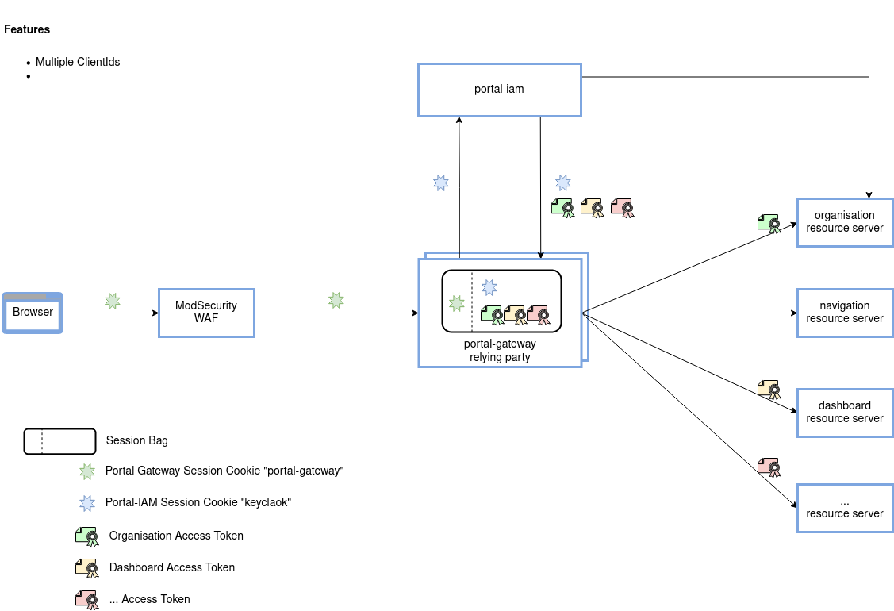

# Customization

Sollen neue Microservices über den Portal-Gateway erreichbar sein, so muss eine eigene Konfiguration erstellt und eingebunden werden. Die nächsten Abschnitte beschrieben das Vorgehen dafür.

## Erstellen einer eigenen Konfiguration

Die Konfiguration des Portal-Gateways erfolgt zweiteilig:

- statisch
- dynamisch

Die statische Konfiguration wird in Form einer JSON Datei angegeben. Darin werden die Objekte für `entrypoints` und `providers` definiert.

Die zweite Stufe ist abhängig von den `providers` aus der statischen Konfiguration. Die dynamische Konfiguration definiert, wie der Portal-Gateway eingehende Requests verarbeitet.

### JSON Schema

Sowohl für die statische als auch für die dynamische Konfiguration gibt es JSON-Schemas, die die Struktur der Konfiguration festlegen. Moderne IDEs (z. B. IntelliJ) können das JSON-Schema verwenden, um den Entwickler beim Schreiben und Validieren der Konfiguration zu unterstützen.

Weitere Informationen zur Benutzung der JSON-Schemas findest du unter dem folgenden [Link](../05-extending-developing/index.md#json-schemas-for-configuration-files).

### Statische Konfiguration

Die JSON Datei für die statische Konfiguration wird beim Start in der angegebenen Reihenfolge gesucht:

1. Datei welche über die Environment Variable `PORTAL_GATEWAY_JSON` angegeben wird
2. Datei welche über das System Property `PORTAL_GATEWAY_JSON` angegeben wird
3. Datei `portal-gateway.json` im `/etc/portal-gateway/default/` Verzeichnis
4. Datei `portal-gateway.json` im aktuellen Verzeichnis (Run Configuration "PortalGateway" := ./server/portal-gateway)

??? example "Beispiel einer statischen Konfiguration"

    Von dieser JSON Datei können weitere Konfigurationsdateien referenziert werden. So verwendet diese Konfigurationsdatei den `file` Provider für die dynamische Konfiguration, wobei weitere Dateien im Unterverzeichnis `./dynamic-config/` enthalten sind.

    ```json
    {
        "entrypoints": [
            {
                "name": "http20000",
                "port": 20000,
                "middlewares": [
                 {
                    "name": "customHeader",
                    "type": "headers",
                    "options": {
                        "customResponseHeaders": {
                            "customResponseHeader": "customResponseValue"
                        },
                        "customRequestHeaders": {
                            "customRequestHeader": "customRequestValue"
                        }
                    }
                }]
            }
        ],
        "providers": [
            {
                "name": "file",
                "directory": "./dynamic-config",
                "watch": false
            }
        ]
    }
    ```

    In diesem Fall muss das referenzierte Verzeichnis `./dynamic-config/` mindestens ein Unterverzeichnis (mit einem beliebigen Namen) enthalten. Darin sind die weiteren JSON Dateien für die Konfiguration von `routers`, `middlewares` und `services` enthalten z. B.:

    ```text
    portal-gateway/server/src/main/resources/
    |-- portal-gateway
    |   |-- dynamic-config
    |   |   |-- auth
    |   |   |   `-- config.json
    |   |   `-- general
    |   |       `-- config.json
    |   `-- portal-gateway.json
    ```

    Falls mehrere Unterverzeichnisse mit JSON-Dateien vorhanden sind, werden JSON-Arrays unter demselben Key konkateniert statt überschrieben. Das erlaubt es, Konfigurationen übersichtlich zu gestalten. Mit der Ordnerstruktur aus dem Beispiel oben können Router einerseits im `auth/config.json` und im `general/config.json` definiert und gleichzeitig verwendet werden.

#### Entrypoints

Entrypoints sind die Netzwerkeingangspunkte von Portal-Gateway. Sie definieren den Port, wo Pakete empfangen werden. Entrypoints sind Teil von der Static Configuration.

| Variable | Benötigt | Typ | Beschreibung |
| --- | --- | --- | --- |
| `name` | Ja | String | Name des Entrypoint entrypoint |
| `port` | Ja | Integer | Port-Nummer |
| `sessionDisabled` | Nein | Boolean | Deaktiviert das Session-Handling (Default: `false`). Ab Version `8.0.0` darf diese Variable **NICHT** mehr gesetzt werden. Die Session ist per Default nicht aktiv bzw. kann nur aktiviert werden die Session-Middleware explizit deklariert wird. |
| `sessionIdleTimeout` | Nein | Integer | Definiert, nach wie viel Minuten eine Session als "idle" angesehen und entfernt wird (Default: `30`) |
| `middlewares` | Nein | Liste von [middlewares](#entry-middlewares) | An jedem Entrypoints können Middlewares angehängt werden, die zunächst durchlaufen werden, bevor ein Request an die route-spezifischen Middlewares weitergeleitet wird. |

#### Applications

Applications definieren die Kernlogik von Portal-Gateway. Sie definieren welche Applications an welchen Ports and Pfaden zuhören (listen).

| Variable                    | Benötigt | Typ    | Beschreibung                                                                                     |
| --------------------------- | -------- | ------ | ------------------------------------------------------------------------------------------------ |
| `name`                      | Ja       | String | Name der Applikation                                                                             |
| `entrypoint`                | Ja       | String | Referenz zu einem existierenden entrypoint, um auf Requests zuzuhören (listen)                   |
| `requestSelector.urlPrefix` | Ja       | String | Pfad, auf welchen die Application zuhört (listen) (TODO Status: not implemented, default is `/`) |
| `provider`                  | Ja       | String | Klassenname von der Application welches Requests bearbeitet                                      |

#### Providers

Der Portal-Gateway kann über Providers konfiguriert werden.

Es werden die folgenden Provider Typen unterstützt:

- File (name = `file`)
- Docker Container (name = `docker`)

##### File Provider

Über den File Provider kann der Portal-Gateway mittels eines JSON Files konfiguriert werden. Es wird die Konfiguration über eine einzelnes oder auch mehrere Files unterstützt.

!!! hint "Keep it DRY"

    Der File Provider kann für die Wiederverwendung von Konfigurationen verwendet werden.

| Variable | Benötigt | Typ | Default | Beschreibung |
| --- | --- | --- | --- | --- |
| `name` | Ja | String | - | Typ des Providers, hier `file` |
| `filename` | Ja oder `directory` | String | - | Definiert den Pfad zu einem Konfigurationsfile |
| `directory` | Ja oder `filename` | String | - | Definiert den Pfad zu dem Directory, welches die Configuration Files beinhaltet. Es ist wichtig zu verstehen, wie mehrere Konfigurationsdateien zusammengefügt werden: Im Allgemeinen werden bei einem Deep-Merge (rekursiv) JSON-Objekte in der bestehenden Struktur abgeglichen und alle übereinstimmenden Einträge ersetzt. JsonArrays werden wie jeder andere Eintrag behandelt, d.h. vollständig ersetzt. Dieses Muster wird auf alle Dateien angewendet, die sich im selben Verzeichnis befinden. Für komplexere Konfigurationen bieten wir einen Merge-Mechanismus über Unterverzeichnisse an. Unterverzeichnisse werden größtenteils auf die gleiche Weise zusammengeführt wie oben beschrieben, mit Ausnahme von JsonArrays. JsonArrays werden ohne Duplikate verkettet. Die Namen der Unterverzeichnisse spielen keine Rolle und können für organisatorische Zwecke verwendet werden. |
| `watch` | Ja | Boolean | - | Setzte watch Option zu `true`, um automatisch auf File Changes zu reagieren. |

##### Docker Provider

Mit Docker können Container Labels benutzt werden, um das Routing im Portal-Gateway konfigurieren zu können.

| Variable | Benötigt | Typ | Default | Beschreibung |
| --- | --- | --- | --- | --- |
| `endpoint` | Nine | String | `unix:///var/run/docker.sock` | Der Portal-Gateway benötigt Zugriff auf den Docker Socket um die dynamische Konfiguration lesen zu können. Der Docker API Endpunkt kann über diese Variable definiert werden. |
| `exposedByDefault` | Nein | Boolean | `true` | Exponiert den Container per default über den Portal-Gateway. Wenn es auf `false` gesetzt ist, werden Container ohne das `portal.enable=true` Label ignoriert |
| `network` | Nein | String | `""` | Definiert das Default Netzwerk das für die Verbindung mit den Containern verwendet wird. |
| `defaultRule` | Nein | String | `Host('${name}')` | Definiert welche Routing-Regel auf den Container angewendet wird, wenn der Container keine definiert. Die Regel muss ein valider [StringSubstitutor](https://commons.apache.org/proper/commons-text/apidocs/org/apache/commons/text/StringSubstitutor.html) sein. Der Container Service Name kann über die `${name}` variable abgerufen werden und der StringSubstitutor hat Zugriff auf eine Labels die für diesen Container definiert sind. |

###### IP/Port Erkennung

Die private IP und Port eines Containers werden von der Docker API abgefragt.

Die Netzwerk- bzw IP-Selektion funktioniert wie folgt:

Der Port wird wie folgt gewählt:

- Wenn der Container **keinen** Port exponiert, wird der Container ignoriert
- Wenn der Container **einen** Port exponiert, wird dieser Port benutzt.
- Wenn der Container **mehrere** Ports exponiert, muss der Port manuell mit dem Label `portal.http.service.<service-name>.server.port` gesetzt werden.

!!! warning "Sicherheitshinweis"

    Den Zugriff auf die Docker API ohne Einschränkungen ist gemäss OWASP [nicht empfohlen](https://cheatsheetseries.owasp.org/cheatsheets/Docker_Security_Cheat_Sheet.html#rule-1-do-not-expose-the-docker-daemon-socket-even-to-the-containers). Wenn der Portal-Gateway attakiert wird, kann der Angreifer Zugriff auf den darunterliegenden Host erhalten:

    ```text
    [...] only trusted users shouls be allowed to control your Docker dameon [...]
    ```
    [Source: Docker Daemon Attack Surface documentation](https://docs.docker.com/engine/security/#docker-daemon-attack-surface)

    !!! success "Solution"

        Der Docker Socket kann auch über SSH exponiert werden. SSH ist mit [Docker > 18.09](https://docs.docker.com/engine/security/protect-access/) unterstützt.

##### Konfigurationsintervall

Status: Funktionalität ist vorhanden, kann allerdings noch nicht konfiguriert werden (der Default wird verwendet).

| Variable                    | Benötigt | Typ     | Default | Beschreibung                                                                                   |
| --------------------------- | -------- | ------- | ------- | ---------------------------------------------------------------------------------------------- |
| `providersThrottleDuration` | Nein     | Integer | `2000`  | Intervall in Millisekunden in der die Konfiguration von den Providern neu gelesen werden soll. |

In manchen Fällen können einige Provider auf einmal viele Konfigurationsänderungen veröffentlichen. Dies würde im Portal-Gateway viele Änderungsevents generieren als nötig. Um dieses Problem zu umgehen, kann diese Option gesetzt werden. Sie setzt wie lange der Portal-Gateway nach einer Neukonfiguration wartet, bevor er neue Änderungen vornimmt. Wenn mehrere Änderungsevents in dieser Zeit registriert werden, wird nur die aktuellste berücksichtigt und der Rest ignoriert. Diese Option kann nur global für alle Provider gesetzt werden, wird allerdings für jeden Provider individuell angewendet.

##### Provider Namespace

Wenn bestimmte Ressourcen in der dynamischen Konfiguration deklariert werden, z. B. Middlewares und Services, befinden sie sich im Namespace ihres Providers. Wenn z. B. eine Middleware mit einem Docker-Label deklariert wird, befindet sich die Middleware im Namespace des Docker-Providers.

Wenn mehrere Anbieter verwendet werden und eine solche Resource referenziert werden soll, das von einem anderen Provider deklariert wurde (z. B. eine Provider übergreifende Resource wie eine Middleware), sollte die Resource mit dem Trennzeichen "@" und dem Provider-Namen versehen werden.

```text
<resource-name>@<provider-name>
```

### Dynamische Konfiguration

Die dynamische Konfiguration enthält alles, was definiert, wie die Requests vom Portal-Gateway behandelt werden. Diese Konfiguration kann sich während der Laufzeit ändern.

#### Routers

Ein Router ist für das Weiterleiten der einkommenden Requests zu den Services verantwortlich, welche diese weiters bearbeiten können. Während diesem Vorgang können Routers Middlewares benutzen, um Requests zu updaten oder zu verändern, bevor sie weiter an den Service weiter geleitet wird.

| Variable | Benötigt | Typ | Beschreibung |
| --- | --- | --- | --- | --- | --- | --- | --- | --- | --- |
| `name` | Ja | String | Name von dem Router |
| `entrypoints` | Nein | List of Strings | Wenn nicht angegeben, so wird der Router Request von allen definierten Entrypoints annehmen. Wenn der Router Scope auf eine Menge von Entrypoints limitiert sein soll, dann setze die Entrypoint Option. |
| `rule` | Nein | `Path('/example')`<br>`PathPrefix('/example')`<br>`PathRegex('/(de\|en)/example')`<br>`Host('example.com')`<br>`HostRegex('foo(bar)?')` | Eine Regel ist ein Matcher, welche mit Werten konfiguriert ist. Diese Werte bestimmten, ob ein bestimmter Request mit einem spezifischen Kriterium zusammenpasst. Sobald die Regel verifiziert wurde, wird der Router aktive. Er benachrichtigt Middlewares und leitet den Request weiter zu den Services. |
| `priority` | Nein | Integer | Routers sind sortiert per default, um Pfadüberlappungen zu vermeiden. Sie werden in absteigender Reihenfolge nach der Länge der Rules sortiert. Die Priorität ist also gleich der Länge von den Regeln, sodass die längste Regel höchste Priorität hat. |
| `middlewares` | Nein | List of Strings | Ein Router kann eine Liste von Middleware haben. Die Middlewares werden nur dann aktiv, wenn die Regel übereinstimmt (match) und bevor der Request an die Services weitergeleitet wird. | Middlewares werden in der gleichen Reihenfolge betätigt, wie sie in der Router-Konfiguration eingetragen sind (Forced Ranking). |  | `service` | Ja | String | Jeder Request muss schliesslich von einem Service bearbeitet werden. Darum sollte jeder Router Definition ein Service Target beinhalten, welches im Prinzip beschreibt, wohin the Request überliefert wird. Im Generellen, ein Service, der einem Router zugewiesen ist, sollte definiert sein. Doch es gibt Ausnahmen bei Label-basierten Providern. Siehe die spezifische Docker Dokumentation. |

!!! example "Beispiel"

    ```json
    {
        "name": "testRouter",
        "middlewares": ["md1", "md2", "md3"],
        "rule": "Path('/')",
        "priority": 42,
        "service": "testService"
    }
    ```

!!! warning

    Das Zeichen `@` ist nicht erlaubt im Name einer Middleware.

#### Middlewares

Middlewares werden an Routers angehängt und optimieren Requests, bevor sie weiter zu einem Service gesendet werden (oder bevor die Antwort von einem Service zu dem Client zurückgesendet worden ist).

Middlewares können in Ketten zusammengehängt werden, somit ist jedes Scenario möglich.

Die Konfiguration einer Middleware besteht immer einem `name`, einem `type` und einem optionalen `options` Feld. Das `options` Feld ist immer ein Objekttyp. Dessen Struktur ist abhängig vom jeweiligen Middleware Type.

!!! example "Beispiel"

    ```json
    {
        "name": "testMiddleware",
        "type": "authorizationBearer",
        "options": { "sessionScope": "testScope" }
    }
    ```

##### `proxy`

Der Proxy ist als eine Middleware implementiert, kann aber **nicht** dynamisch gesetzt werden. Der Proxy ist immer der letzte Middleware in der Kette und leitet die eingehenden Request weiter an die Services.

##### `bodyHandler`

Die Bodyhandler Middleware wird momentan nur im Kontext von CSRF verwendet/benötigt und sollte nur wenn nötig gesetzt werden.

##### `headers`

Die Headers Middleware verwaltet die Headers der eingehenden Requests und der ausgehenden Responses.

| Variable                | Benötigt | Typ                            | Beschreibung |
| ----------------------- | -------- | ------------------------------ | ------------ |
| `customRequestHeaders`  | Nein     | Pairs of header name and value | -            |
| `customResponseHeaders` | Nein     | Pairs of header name and value | -            |

##### `customResponse`

Mit dieser Middleware können fest kodierte Antworten an den Client zurückgegeben werden. Folgende Optionen werden unterstützt:

| Variable     | Benötigt | Typ                                 | Beschreibung |
| ------------ | -------- | ----------------------------------- | ------------ |
| `content`    | Ja       | String                              | -            |
| `statusCode` | Ja       | Integer                             | -            |
| `headers`    | Nein     | Paare aus Name und Wert der Headers | -            |

##### `oauth2`

Diese Middleware ermöglicht die Authentifizierung eines Benutzers durch eine Keycloak-Serverinstanz. Es fängt alle Anfragen ab und leitet sie bei Bedarf zur Authentifizierung weiter. Nach erfolgreicher Authentifizierung speichert er das ID-Token und das Access-Token unter dem gegebenen Session scope.

Spezifikationen:

- [OAuth2](https://www.rfc-editor.org/rfc/rfc6749.html)
- [OIDC](https://openid.net/specs/openid-connect-core-1_0.html)

| Variable | Benötigt | Typ | Default | Beschreibung |
| --- | --- | --- | --- | --- |
| `clientId` | Ja | String |  | Provider client id |
| `clientSecret` | Ja | String |  | Provider client secret |
| `discoveryUrl` | Ja | URL |  | Provider discovery URL. Für Keycloak normalerweise `https://keycloak.ch/auth/realms/<your-realm>` |
| `sessionScope` | Ja | String |  | - |
| `additionalScopes` | Nein | Array | empty | Zusätzliche Oauth2 Scopes |
| `responseMode` | Nein | query, fragment, form_post | form_post | Default ist form_post |
| `proxyAuthenticationFlow` | Nein | boolean | true | Falls gesetzt, wird der `authorization_path` und der `issuer` mit dem public URL des Portal-Gateway gepatched (siehe `publicUrl`). Damit kann erreicht werden, dass der Authentisierungsprozess immer über den Portal-Gateway abgewickelt wird. |
| `publicUrl` | Nein | URL | empty | Um den `redirect_uri` für denn Oauth2 Callback richtig zu setzen, muss die Middleware wissen unter welchem URL der Portal-Gateway erreichbar ist. Grundsätzlich werden dafür die Environment Variablen `PORTAL_GATEWAY_PUBLIC_PROTOCOL`, `PORTAL_GATEWAY_PUBLIC_HOSTNAME` und `PORTAL_GATEWAY_PUBLIC_PORT` verwendetet. Diese können allerding pro Middleware mit diesem Property übersteuert werden. Das ist nötig, falls `oauth2` Middlewares unter verschieden Hosts verwendet werden. |
| `additionalParameters` | Nein | Map | empty | Zusätzliche Oauth2 Auth Request Parameter. |
| `passthroughParameters` | Nein | Array | empty | Diese List ist eine Whitelist für Parameter Keys, die den Oauth2 Auth Request Parameters hinzugefügt werden, wenn sie im initialen Request, der den Auth Request ausgelöst hat, vorkommen. Falls ein Parameter Key im initialen Request mehrfach vorkommt, wird nur der erste Parameter Value hinzugefügt. Die `passthroughParameteres` überschreiben Parameter, die durch `additionalParameters` hinzugefügt wurden. Die Options ist interessant, wenn dem Authorization Provider dynamisch Infos weitergeleitet werden müssen, wie z.B. `kc_idp_hint`, |

Es wird empfohlen `responseMode=form_post` nur zu verwenden, wenn garantiert ist, dass die erste geladene Ressource vom Mime-Type `text/html` ist.

!!! note

    Die `oauth2` Middleware generiert einen internen Callback-URL im Format `/callback/<sessionScope>`, um den Authorization Code von Keycloak zu erhalten.

##### `oauth2registration`

Diese Middleware ermöglicht den direkten Aufruf der Selbstregistrierung eines Benutzers an einer Keycloak-Serverinstanz. Es fängt alle Anfragen ab und leitet sie bei Bedarf zur Registrierung weiter. Nach erfolgreicher Registrierung speichert er das ID-Token und das Access-Token unter dem gegebenen Session scope.

Die `oauth2registration` kann die gleichen Konfigurationsparameter, wie die `oauth2` Middleware entgegennehmen.

##### `authorizationBearer`

Der Authorization Bearer setzt ein Token im HTTP-Header `Authorization: Bearer <token>` abhängig vom Session Scope. Er ist eng an die OAuth2 Middleware gekoppelt, da er Tokens verwendet, die durch den Authentifizierungsprozess erworben wurden.

| Variable | Benötigt | Typ | Beschreibung |
| --- | --- | --- | --- |
| `sessionScope` | Ja | id (referencing a session scope defined by a OAuth2 middleware) | Der Session Scope legt fest, welches Token im Auth Bearer Header gesetzt werden soll. Dies kann entweder ein ID-Token oder ein Access-Token sein. Pro Benutzer gibt es ein ID-Token und null oder mehr Access-Tokens. |

##### `bearerOnly`

Diese Middleware überprüft für jeden eingehenden Request, ob ein HTTP `Authorization` Header vorliegt und ein gültiges JWT enthält. Für die Gültigkeit werden die Signatur und die Claims für Issuer und Audience überprüft. Die dafür verwendeten Werte werden via `options` definiert:

| Variable | Benötigt | Typ | Beschreibung |
| --- | --- | --- | --- |
| `publicKeys` | Ja | Array | Ein Array von Public Keys. Jedes Element (Public Key) im Array ist ein Object mit den Feldern `publicKey` und optional `publicKeyAlgorithm`. Der Wert `publicKey` ist ein öffentlicher Schlüssel im PEM Format (ohne Header/Footer) oder URL für den Abruf des öffentlichen Schlüssels beim Portal-IAM (z.B. http://portal-iam:8080/auth/realms/portal). Dazu wird der OIDC Discovery Mechanismus benutzt und alle öffentlichen Schlüssel, die unter dem URL `jwks_uri` gefunden werden und zur Erstellung einer Signatur verwendet werden geladen. Falls der `publicKey` einen öffentlichen Schlüssel im PEM Format beinhaltet, kann auch der Wert `publicKeyAlgorithm` gesetzt werden, ansonsten wird der Default verwendet: `RS256`. |
| `issuer` | Nein | String | Wert den der `sub` Claim im JWT besitzen muss |
| `additionalIssuers` | Nein | Array | Ein Array von zusätzlichen Issuers. Falls weitere Issuer als `issuer` in Frage kommen, können sie in diesem Array deklariert werden. |
| `audience` | Nein | String | Wert den der `aud` Claim im JWT besitzen muss |
| `optional` | Nein | Boolean | Switch ob der Authorization Header im Request ein Muss ist |
| `claims` | Nein | Array | Ein Array von Anforderungen, die jedes JWT erfüllen muss. Jedes Element(Anforderung) im Array ist ein Objekt mit den Feldern `claimPath`, `operator` und `value`. Der Wert `value` im Pfad `claimPath`, der als JSONPath (https://datatracker.ietf.org/doc/draft-ietf-jsonpath-base/) in bracket-notation angegeben ist, wird mit dem Claim im JWT an diesem Pfad gemäss dem Operator `operator` verglichen. Folgende Operatoren werden zurzeit unterstützt: <br/> <br/> `EQUALS`: Der Wert im Claim JWT muss mit `value` übereinstimmen.<br/> `CONTAINS`: Der Wert im Claim JWT muss in `value` enthalten sein. `value` muss zwingend als Liste angegeben sein! <br/> `EQUALS_SUBSTRING_WHITESPACE` und `CONTAINS_SUBSTRING_WHITESPACE`: Anstatt `value` als Liste anzugeben, kann man die Elemente durch Leerzeichen trennen. |
| `publicKeysReconcilation` | Nein | Object | Ein Object mit den beiden Feldern `enabled` und `intervalMs`. Per default ist `enabled` auf `true` und `intervalMs` auf `600000` (1h) gesetzt. Grundsätzlich, lädt die `bearerOnly` middleware die aktuellen Public Keys, die vom Portal-IAM zum Signieren der JWTs verwendet werden, vom Portal-IAM beim Starten des Portal-Gateways. Der Public Key Reconciler kann automatisch die Public Keys in einem definierten Interval aktualisieren. Damit soll sichergestellt werden, dass im Falle eines Key Rollovers, der Portal-Gateway nicht neugestartet werden muss, sondern automatisch die neuen Public Keys kennt und akzeptiert. Zusätzlich, werden im Falle eines `Unauthorized` Requests (401) die Public Keys automatisch aktualisert und der Request _einmalig_ wiederholt. Damit sollen JWTs, die mit einem neuen Public Key signiert worden sind, das Reconcilation Interval allerdings noch nicht abgelaufen ist, trotzdem verifizierbar sein. |

Die Angabe von `issuer` und `audience` ist optional. Soll der `Authorization` Header als ganzes optional sein, so kann dies im `optional` Feld mit `true` definiert werden.

??? example "Beispiel"

    ```json
    {
        "name": "bearerOnly",
        "type": "bearerOnly",
        "options": {
            "publicKey": "https://portal-iam:8080/auth/realms/portal",
            "publicKeyAlgorithm": "RS256",
            "issuer": "${PROXY_BEARER_TOKEN_ISSUER}",
            "audience": ["Portal-Gateway", "Navigation"],
            "optional": false,
            "claims": [
                {
                    "claimPath": "$['organisation']",
                    "operator": "EQUALS",
                    "value": "portal"
                },
                {
                    "claimPath": "$['resource_access']['Organisation']['roles']",
                    "operator": "CONTAINS",
                    "value": ["ADMINISTRATOR", "TENANT"]
                },
                {
                    "claimPath": "$['https://hasura.io/jwt/claims']",
                    "operator": "EQUALS",
                    "value": {
                        "x-hasura-allowed-roles": ["KEYCLOAK", "portaluser"],
                        "x-hasura-portaluser-id": "1234"
                    }
                }
            ],
            "publicKeysReconcilation": {
                "enabled": "true",
                "intervalMs": "600000"
            }
        }
    }
    ```

##### `passAuthorization`

Diese Middleware ist eine Kombination von `authorization` und `bearerOnly` Middleware und akzeptiert ein **Superset** von den beiden Middleware-Konfigurationen. Sie überprüft, ob der Incoming Request in seiner Session ein Access Token unter dem konfigurierten `sessionScope` besitzt (`authorization`), welches die konfigurierten JWT Claims erfüllt (`bearerOnly`).

Der Name indiziert bereits, dass der Wert im `Authorization` Header vom Incoming Request nicht modifiziert wird, sondern so durchgegeben wird. Das ist nötig falls ein Frontend bereits JWTs schickt welche bis zum Backend gelangen müssen, der Portal-Gateway aber trotzdem authN/authZ umsetzen möchte.

##### `backchannellogout`

<!-- TODO -->

##### `redirectRegex`

Redirect Regex leitet ein Request mithilfe von Regex-Matching und Replacement um.

| Variable | Benötigt | Typ | Beschreibung |
| --- | --- | --- | --- |
| `regex` | Ja | String | Die Option regex ist der reguläre Ausdruck (regular expression), mit dem Elemente aus der Request-URL abgeglichen (match) und erfasst werden. |
| `replacement` | Ja | String | Die Replacement Option legt fest, wie die URL geändert werden soll, damit sie die neue Ziel-URL erhält. |

##### `replacePathRegex`

Replace Path Regex ersetzt den Pfad einer URL durch Regex-Matching und Replacement.

| Variable | Benötigt | Typ | Beschreibung |
| --- | --- | --- | --- |
| `regex` | Ja | String | Die Option regex ist der reguläre Ausdruck (regular expression), mit dem der Pfad aus der Request-URL abgeglichen (match) und erfasst wird. |
| `replacement` | Ja | String | Die Option replacement definiert das Format des Replacement Pfads, der erfasste Variablen enthalten kann. |

##### `languageCookie`

Die Language Cookie Middleware fügt den Wert (ISO-Code) des (per Default: `uniport.language`) Cookies in den Accept-Language Header. Dabei wird der vorherige Accept-Language Header überschrieben. Falls kein Language Cookie in der Request vorhanden ist, wird nichts verändert.

| Variable | Benötigt | Typ    | Default            | Beschreibung               |
| -------- | -------- | ------ | ------------------ | -------------------------- |
| `name`   | Nein     | String | `uniport.language` | Name des Language Cookies. |

!!! example "Beispiel"

    ```json
    {
        "name": "languageCookie",
        "type": "languageCookie"
    }
    ```

##### `_session_`

Diese Middleware ist nur für die **Entwicklung** gedacht. Sie zeigt den aktuellen Session-Content an. Dazu gehören die Session-ID, jedes Cookie und, falls angemeldet, das ID-Token (encoded und decoded), jedes Access Token (encoded and decoded).

!!! example "Beispiel"

    ```json
    {
        "name": "ShowSessionContentMiddleware",
        "type": "_session_"
    }
    ```

##### `checkRoute`

Die CheckRoute Middleware vom Typ `checkRoute` gibt für einen Request direkt den Status Code `202` zurück, falls in der URI des Requests der Wert `_check-route_` gefunden wird. Andernfalls wird der Request nicht beachtet von dieser Middleware.

!!! example "Beispiel"

    ```json
    {
        "name": "CheckAuthMiddleware",
        "type": "checkRoute"
    }
    ```

Wenn diese Middleware in einer Route, welche eine Authentifizierung voraussetzt, platziert wird, so kann damit auf Clientseite überprüft werden, ob eine gültige Session vorliegt. Denn wenn der Client den Status Code `200` erhält, so kann dies auch das Result der übermittelten Login Seite sein. Typischerweise wird diese Route aufgerufen, wenn der Client für einen POST Request einen Fehler Status Code (z.B. `405`) zurück bekommt. Nach der Überprüfung der Session mit `checkRoute` kann entschieden werden, ob der POST Request nochmalig aufgerufen wird.

##### `csrf`

Die CSRF Middleware implementiert die [Double Submit Cookie](https://cheatsheetseries.owasp.org/cheatsheets/Cross-Site_Request_Forgery_Prevention_Cheat_Sheet.html#double-submit-cookie) Strategie, um Cross-Site Request Forgery Attacken entgegenzuwirken. Die Middleware generiert bei jedem `GET`-Request ein CSRF Cookie, dessen Wert dann in `POST`, `PUT`, `PATCH`, `DELETE`-Requests entweder im Header oder im Body gesetzt werden muss.

!!! bug

    Bei der Verwendung der CSRF-Middleware wird davon ausgegangen, dass die Session-Middleware und die Bodyhandler-Middleware vor der CSRF-Middleware durchlaufen werden. Momentan funktioniert aber die Bodyhandler Middleware nicht und sollte nicht eingesetzt werden, dies hat zur Folge, dass bei fehlendem CSRF Token ein 500 HTTP-Fehler zurückgegeben wird anstatt 403.

| Variable | Benötigt | Typ | Default | Beschreibung |
| --- | --- | --- | --- | --- |
| `timeoutInMinute` | Nein | Int | `15` | CSRF Cookie Timeout in Minuten. |
| `nagHttps` | Nein | Boolean | `true` | Wenn der Request über HTTP (anstatt HTTPS) kommt, soll das geloggt werden. |
| `headerName` | Nein | String | `X-XSRF-TOKEN` | Name des Headers indem der Wert des CSRF Cookies erwartet wird. |
| `origin` | Nein | String |  | Legt den Origin für diesen Server fest. Wenn dieser Wert gesetzt ist, findet eine zusätzliche Überprüfung statt. Die Anfrage muss mit dem Origin Server, dem Port und dem Protokoll übereinstimmen. |
| `cookie` | Nein | Object |  | CSRF-Cookie Konfiguration |
| `cookie.name` | Nein | String | `XSRF-TOKEN` | Name vom CSRF-Cookie. |
| `cookie.path` | Nein | String | `/` | Pfad vom CSRF-Cookie. |
| `cookie.secure` | Nein | Boolean | `true` | Wenn dieses Flag gesetzt ist, werden die Browser angewiesen, das Cookie nur über HTTPS zu senden. Beachte, dass dies wahrscheinlich dazu führt, dass die Sitzungen nicht mehr funktionieren, wenn sie ohne HTTPS verwendet werden (z. B. in der Entwicklung). |

!!! example "Beispiel"

    ```json
    {
        "name": "csrf",
        "type": "csrf",
        "options": {
            "timeoutInMinute": 15,
            "nagHttps": true,
            "headerName": "X-Uniport-XSRF-TOKEN",
            "cookie": {
                "name": "uniport.xsrf-token",
                "secure": false
            }
        }
    }
    ```

##### `cors`

Die CORS Middleware implementiert das CORS Protokoll. CORS ist ein sicherer Mechanismus, um Resourcen, welche von einem Host angefordert werden, aber von einem anderen Host zur Verfügung gestellt werden, zu teilen.

Weiterführende Information zur CORS können hier gefunden werden:

- [MDN - Cross-Origin Resource Sharing (CORS)](https://developer.mozilla.org/en-US/docs/Web/HTTP/CORS)
- [MDN - Headers](https://developer.mozilla.org/en-US/docs/Web/HTTP/Headers/Access-Control-Allow-Origin)
- [Fetch API](https://fetch.spec.whatwg.org/#http-cors-protocol)

| Variable | Benötigt | Typ | Default | Beschreibung |
| --- | --- | --- | --- | --- |
| `allowedOrigins` | Nein | String Array | - | Set the list of allowed origins. An origin follows [rfc6454#section-7](https://www.rfc-editor.org/rfc/rfc6454#section-7) and is expected to have the format: `<scheme> "://" <hostname> [ ":" <port> ]`. |
| `allowedOriginPatterns` | Nein | Regex String Array | - | Set the list of allowed relative origins. A relative origin is a regex that should match the format `<scheme> "://" <hostname> [ ":" <port> ]`. |
| `allowedMethods` | Nein | String Array | - | Set the list if allowed methods. A method is one of `GET`, `HEAD`, `POST`, `PUT`, `DELETE`, `PATCH`, `OPTIONS`, `TRACE`, `CONNECT`. |
| `allowedHeaders` | Nein | String Array | - | Set the list if allowed headers. |
| `exposedHeaders` | Nein | String Array | - | Set the list if exposed headers. |
| `maxAgeSeconds` | Nein | Int | - | Set how long the browser should cache the information. Default implemented by browser is 5 seconds, in case there is no max age header. Maximum is browser-specific (firefox: 24h, chromium: 2h) |
| `allowCredentials` | Nein | Boolean | false | Set whether credentials are allowed. Note that user agents will block requests that use a wildcard as origin and include credentials. |
| `allowPrivateNetwork` | Nein | Boolean | false | Set whether access from public to private networks are allowed. |

Wenn weder `allowedOrigins` noch `allowedOriginPatterns` konfiguriert ist, impliziert das eine `*`/Wildcard (alle Origins sind erlaubt) Konfiguration.

!!! example "Beispiel"

    ```json
    {
        "name": "cors",
        "type": "cors",
        "options": {
            "allowedOrigins": [
                "https://example.com"
            ],
            "allowedOriginPatterns": [
                "https://.*\\.example.com"
            ],
            "allowedMethods": [
                "GET",
                "POST",
                "PUT",
                "DELETE"
            ],
            "allowedHeaders": [
                "foo"
            ],
            "exposedHeaders": [
                "bar"
            ],
            "maxAgeSeconds": 42,
            "allowCredentials": true,
            "allowPrivateNetwork": true
        }
    }
    ```

##### `claimToHeader`

Die ClaimToHeader Middleware kann den Wert eines JWT Claims als HTTP Header setzen, damit andere Komponenten den Wert direkt vom Header auslesen können.

| Variable     | Benötigt | Typ                                               | Default | Beschreibung     |
| ------------ | -------- | ------------------------------------------------- | ------- | ---------------- |
| `claimPath`  | Ja       | [JsonPath](https://github.com/json-path/JsonPath) | -       | Pfad zum Claim   |
| `headerName` | Ja       | String                                            | -       | Name des Headers |

!!! example "Beispiel"

    ```json
    {
        "name": "tenantFromJwtToHeader",
        "type": "claimToHeader",
        "options": {
            "claimPath": "tenant",
            "headerName": "X-Uniport-Tenant"
        }
    }
    ```

##### `cspViolationReportingServer`

Die [Content Security Policy](https://developer.mozilla.org/en-US/docs/Web/HTTP/Headers/Content-Security-Policy) unterstützt [Reporting Directives](https://developer.mozilla.org/en-US/docs/Web/HTTP/Headers/Content-Security-Policy#reporting_directives), um CSP Violations zu melden. Die `cspViolationReportingServer` Middleware kann als Reporting Server verwendet werden, der via `report-uri` resp. `report-to` Directive gesetzt werden kann. Sie logt, alle CSP Violation Reports auf dem konfigurierten Log Level.

| Variable   | Benötigt | Typ                                       | Default | Beschreibung                         |
| ---------- | -------- | ----------------------------------------- | ------- | ------------------------------------ |
| `logLevel` | Nein     | `TRACE`, `DEBUG`, `INFO`, `WARN`, `ERROR` | `WARN`  | Log Level für CSP Violation Reports. |

??? example "Beispiel"

    Mit folgender Konfiguration wird ein CSP Violation Reporting Server auf dem Pfad `/csp-reports` erstellt.

    ```json
    {
        "http": {
            "routers": [
                {
                    "name": "csp-violation-reporting-server",
                    "middlewares": [
                        "cspViolationReportingServer"
                    ],
                    "rule": "Path('/csp-reports')",
                    "service": "dashboard-proxy"
                }
            ],
            "middlewares": [
                {
                    "name": "cspViolationReportingServer",
                    "type": "cspViolationReportingServer",
                    "options": {
                        "logLevel": "ERROR",
                    }
                }
            ],
            "services": []
        }
    }
    ```

    Diese kann zusammen mit einer `csp` Middleware benutzt werden:

    ```json
    {
        "name": "csp",
        "type": "csp",
        "options": {
            "policyDirectives": [
                {
                    "directive": "report-uri",
                    "values": [
                        "/csp-reports"
                    ]
                },
                {
                    "directive": "report-to",
                    "values": [
                        "/csp-reports"
                    ]
                },
                [...]
            ]
        }
    }
    ```

!!! caution "Unterschied zwischen den `report-uri` und `report-to` Directives"

    Es gibt `report-uri` und `report-to` als [Reporting Directive](https://developer.mozilla.org/en-US/docs/Web/HTTP/Headers/Content-Security-Policy#reporting_directives), welche für das Reporting von CSP Violations zur Verfügung stellen. `report-uri` ist deprecated und sollte nicht mehr verwendet wernde. Allerdings unterstützen noch nicht alle Browser (speziell Firefox) den `report-to` Reporting Directive und daher können/müssen/sollten beide Reporting Directives gesetzt werden, um alle Browser abzudecken. Browser, die `report-to` bereits unterstützen, ignorieren `report-uri` und Browser, die noch nicht `report-to` unterstützen, verwenden `report-uri` und loggen allenfalls eine Warning, dass eine unbekannte Directive verwendet wird `report-to`.

##### `matomo`

Die Matomo Middleware sollte ausschliesslich für Portal-Analytics verwendet werden. In Kombination mit unserem AutoLogin Feature für Matomo, ermöglicht es das automatische Login anhand von Request Header Werten. Die Middleware liest das Access Token im Authorization Header aus und setzt dann die benötigten Werte im Request Header. Der Pfad zu den Werten muss als JsonPath angegeben werden.

| Variable       | Benötigt | Typ                                               | Default                           | Beschreibung              |
| -------------- | -------- | ------------------------------------------------- | --------------------------------- | ------------------------- |
| `pathRoles`    | nein     | [JsonPath](https://github.com/json-path/JsonPath) | $.resource_access.Analytics.roles | Pfad zu den Rollen        |
| `pathGroup`    | nein     | [JsonPath](https://github.com/json-path/JsonPath) | $.tenant                          | Pfad zum Gruppen Namen    |
| `pathUsername` | nein     | [JsonPath](https://github.com/json-path/JsonPath) | $.preferred_username              | Pfad zum Username         |
| `pathEmail`    | nein     | [JsonPath](https://github.com/json-path/JsonPath) | $.email                           | Pfad zu der Email Adresse |


#### Entry-Middlewares

Die folgenden Entry-Middlewares werden normalerweise an Entrypoints anstelle von Routern angehängt. Es ist jedoch auch möglich, die Entry-Middlewares als normale [(Route-)Middlewares](#middlewares) zu verwenden und auch umgekehrt (Route)-Middlewares als Entry-Middlewares zu verwenden. Entry-Middlewares werden in der [statischen Konfiguration](#statische-konfiguration) definiert.

##### `openTelementry`

Die Middleware sorgt dafür, dass im Logging Context die Keys `traceId` und `sessionId` verfügbar sind. Diese werden anschliessend in der Konfiguration des Log Patterns mittels `%vcl{traceId}` für verwendet, damit jede Log-Ausgabe diese beiden Werte beinhaltet.

Zusätzlich setzt die Middleware in der HTTP Response den Header `X-Uniport-Trace-Id`, welche ebenfalls den Wert der `traceId` beinhaltet.

##### `replacedSessionCookieDetection`

Die Middleware verarbeitet alle Requests vom Browser, welche während der Regeneration der Session Id gesendet werden (Siehe Abbildung). Diese Requests werden von der Middleware anhand eines "Detection"-Cookies, dessen Name konfigurierbar ist ("name"), erkannt und dann als Redirect (=retry) Response an dieselbe URL zurückgeschickt (es wird keine neue Session Id mitgegeben). Die Redirect Response wird aber erst nach einem konfigurierbarem Timeout ('waitTimeInMillisecond') zurückgeschickt, in der Hoffnung, dass zwischenzeitlich die neue Session Id beim Browser angekommen ist.


| Variable                | Benötigt | Typ    | Default       | Beschreibung                                                                |
| ----------------------- | -------- | ------ | ------------- | --------------------------------------------------------------------------- |
| `name`                  | Nein     | String | uniport.state | Name des "Detection"-Cookies.                                               |
| `waitTimeInMillisecond` | Nein     | String | 50            | Timeout bei der Redirect Response in Millisekunden                          |
| `maxRedirectRetries`    | Nein     | Int    | 5             | Maximale Anzahl an Redirect-Versuchen, bevor Requests durchgelassen werden. |

##### `responseSessionCookieRemoval`

Die Middleware wird (Stand heute: 19. Oktober 2022) nur in Kombination mit der [replacedSessionCookieDetection](#replacedsessioncookiedetection)-Middleware verwendet. Werden Requests während der Session Id Regeneration gesendet, werden diese von der `replacedSessionCookieDetection`-Middleware als Redirect(=retry) Response an dieselbe URL zurückgeschickt. Die Middleware entfernt das "veraltete" Session-Cookie während der Redirect-Response, da der Browser sonst das neue Session-Cookie mit dem alten überschreiben könnte.

| Variable                               | Benötigt | Typ    | Default         | Beschreibung                                                              |
| -------------------------------------- | -------- | ------ | --------------- | ------------------------------------------------------------------------- |
| <p name="cookieNameRemoval">`name`</p> | Nein     | String | uniport.session | Name des Session-Cookies. Muss mit [cookie.name](#session) übereinstimmen |

##### `session`

Die Session-Middleware verwaltet Browser-Sessions. Jede Anfrage kann anhand des Session-Cookies, das ebenfalls von dieser Middleware ausgestellt wird, einer Session zugeordnet werden. Details zur Session-Verwaltung können konfiguriert werden.

| Variable | Benötigt | Typ | Default | Beschreibung |
| --- | --- | --- | --- | --- |
| `idleTimeoutInMinute` | Nein | Int | `15` | Session Timeout in Minuten. |
| `idMinimumLength` | Nein | Int | `32` | Minimale Länge der Session ID. |
| `nagHttps` | Nein | Boolean | `true` | Wenn der Request über HTTP (anstatt HTTPS) kommt, soll das geloggt werden. |
| `lifetimeHeader` | Nein | Boolean | `false` | Wenn dieses Flag gesetzt ist, so wird in in der Response der Header `x-uniport-session-lifetime` mit dem Sessionablauf zurück gegeben. |
| `lifetimeCookie` | Nein | Boolean | `false` | Wenn dieses Flag gesetzt ist, so wird in in der Response das Cookie `uniport.session-lifetime` mit dem Sessionablauf zurück gegeben. |
| `uriWithoutSessionTimeoutReset` | Nein | Regex |  | Regex für URIs für welche Requests kein Session Timeout Reset erfolgen soll (z.B. `*._polling_.*`). |
| `cookie` | Nein | Object |  | Session-Cookie Konfiguration |
| <p name="cookieNameSession">`cookie.name`</p> | Nein | String | `uniport.session` | Name des Session-Cookies. Muss mit [name](#responsesessioncookieremoval) übereinstimmen |
| `cookie.httpOnly` | Nein | Boolean | `true` | Wenn dieses Flag gesetzt ist, werden die Browser angewiesen, den Zugriff von Javascript auf das Cookie zu verhindern. Dies dient als Schutz vor den häufigsten XSS-Angriffen. |
| `cookie.secure` | Nein | Boolean | `false` | Wenn dieses Flag gesetzt ist, werden die Browser angewiesen, das Cookie nur über HTTPS zu senden. Beachte, dass dies wahrscheinlich dazu führt, dass die Sitzungen nicht mehr funktionieren, wenn sie ohne HTTPS verwendet werden (z. B. in der Entwicklung). |
| `cookie.sameSite` | Nein | String | `STRICT` | SameSite policy für das Session-Cookie. Mögliche Werte: <strong>NONE</strong> (Der Browser sendet Cookies sowohl bei cross-site als auch bei same-site Requests), <strong>STRICT</strong> (Der Browser sendet nur Cookies same-site Requests. Wenn die Request von einer anderen URL als der URL des aktuellen Standorts stammt, wird keines der mit dem Attribut Strict gekennzeichneten Cookies gesendet.) <strong>LAX</strong> (Same-Site-Cookies werden bei cross-site subrequests nicht mitgesendet, z. B. bei Requests zum Laden von Bildern oder Frames. Werden aber gesendet, wenn ein Nutzer die URL von einer externen Site aufruft, z. B. wenn er einem Link folgt.) |
| `clusteredSessionStoreRetryTimeoutInMiliseconds` | Nein | Int | `5000` | Retry Timeout, in Milisekunden, wenn eine Session nicht im Clustered-Session-Store gefunden wird. |

!!! example "Beispiel"

    ```json
    {
        "name": "session",
        "type": "session",
        "options": {
            "idleTimeoutInMinute": 15,
            "idMinimumLength": 32,
            "nagHttps": true,
            "cookie": {
                "name": "uniport.session",
                "httpOnly": true,
                "secure": false,
                "sameSite": "STRICT"
            },
            "clusteredSessionStoreRetryTimeoutInMiliseconds": 5000
        }
    }
    ```

##### `sessionBag`

Der Session Bag ist als eine Middleware implementiert. Sie sollte als letzte Entry-Middleware gesetzt werden in der Kette und ist verantwortlich für das Cookie-Handling. Der User-Agent sieht im Allgemeinen kein anderes Cookie als das Vert.x-Session-Cookie. Der Session Bag verwaltet alle Cookies, die sich auf dieser Session beziehen. Es fängt Antworten von Services ab, löscht und speicher sie. In zukünftige Request von der gleichen Session werden diese Cookies wieder hinzugefügt, sodass die Services keinen Unterschied merken.

Es können Ausnahmen konfiguriert werden, damit Cookies auch zum User-Agent zurückgegeben werden.

| Variable | Benötigt | Typ | Beschreibung |
| --- | --- | --- | --- |
| `whitelistedCookies` | Nein | Array | Jedes Element im Array ist ein Objekt mit den Feldern `name` und `path`. Das Feld `name` definiert den Namen und `path` den Pfad des Cookies. Wenn es eine Übereinstimmung gibt, so wird das Cookie zum User-Agent retourniert. |

Eine Ausnahme von dieser Regel ist das Keycloak-Session-Cookie für den Master-Realm. Dies ist das einzige Cookie, abgesehen vom Vert.x-Session-Cookie, das an den User-Agent weitergegeben wird. Dies ist für einige Keycloak Seiten erforderlich.



##### `requestResponseLogger`

Loggt jede Request und/oder Response und fügt die requestId und die sessionId zu den kontextuellen Daten hinzu. Je nach eingestelltem Log-Level im portal-gateway/proxy werden mehr oder weniger Details von der Request/Response geloggt.

!!! tip

    Nur auf dem `TRACE` Log-Level wird der Body geloggt.

| Variable | Benötigt | Typ | Default | Beschreibung |
| --- | --- | --- | --- | --- |
| `contentTypes` | Nein | String Array | [] | Loggt den Body der angegeben [Content-Types](https://developer.mozilla.org/en-US/docs/Web/HTTP/Headers/Content-Type). |
| `loggingRequestEnabled` | Nein | Boolean | True | Ein Array von Policy Directives. Jedes Element(Directive) im Array ist ein Objekt mit den Feldern `directive` und `values`, wobei `values` ein Array von mehreren oder einzelnen Werten ist. |
| `loggingResponseEnabled` | Nein | Boolean | True | Ein Array von Policy Directives. Jedes Element(Directive) im Array ist ein Objekt mit den Feldern `directive` und `values`, wobei `values` ein Array von mehreren oder einzelnen Werten ist. |

##### `csp`

_DISCLAIMER_: Directives ohne values (bspw: sandbox) werden erst ab Portal-Gateway Version 8.2.0+ unterstützt. Microservices (bspw. Portal-Monitoring), welche solche Directives als CSP-Policies zurückgeben, werden nicht funktionieren bzw. der Gateway kann die Resourcen auf diesem Path nicht laden.

Mit der [Content Security Policy](https://developer.mozilla.org/en-US/docs/Web/HTTP/Headers/Content-Security-Policy) Middleware können wir festlegen, welche Ressourcen der Browser laden darf. Ab Portal Gateway Version 8.1.0+ ist es nun möglich, mehrere aufeinanderfolgende CSP-Middlewares für eine Route zu definieren: z.B. allgemeine CSP-Policies auf der Entry-Middleware und spezifische/restriktive CSP-Policies auf jeder spezifischen Route. Die Vereinigung/Union aller CSP-Policies wird dann durchgesetzt.

| Variable | Benötigt | Typ | Default | Beschreibung |
| --- | --- | --- | --- | --- |
| `reportOnly` | Nein | Boolean | false | [Content-Security-Policy-Report-Only](https://developer.mozilla.org/en-US/docs/Web/HTTP/Headers/Content-Security-Policy-Report-Only) aktivieren. Wenn aktiv, muss auch `report-to` als directive vorhanden sein. |
| `policyDirectives` | Ja | Array | - | Ein Array von Policy Directives. Jedes Element(Directive) im Array ist ein Objekt mit den Feldern `directive` und `values`, wobei `values` ein Array von mehreren oder einzelnen Werten ist. |
| `mergeStrategy` | Nein | `UNION`, `INTERNAL`, `EXTERNAL` | `UNION` | Die `mergeStrategy` bestimmt, wie externe CSP-Policies (die z.B. vom Portal IAM gesetzt werden) verwendet werden. Die externen CSP-Policies werden aus den Headern `Content-Security-Policy` und `Content-Security-Policy-Report-Only` ausgelesen und vereint/union. Mit `UNION` wird die Vereinigung/Union der Middleware CSP Policies und der externen CSP Policies als finale CSP Policy durchgesetzt. Mit `EXTERNAL` wird die externe CSP-Policy durchgesetzt und mit `INTERNAL` die Middleware-Policy. |

!!! warning

    Im Falle mehrerer CSP-Middlewares für eine Route bestimmt die zuletzt durchlaufene Middleware die `mergeStrategy` zwischen externen und internen CSP-Policies. Im unteren Schema ist das die `CSP2` Middleware respektive die `Resp2``.

    

!!! example "Beispiel"

    ```json
    {
        "name": "csp",
        "type": "csp",
        "options": {
            "policyDirectives": [
                {
                    "directive": "default-src",
                    "values": ["self"]
                },
                {
                    "directive": "style-src",
                    "values": ["https://fonts.googleapis.com", "https://fonts.gstatic.com", "self", "unsafe-inline"]
                }
            ]
        }
    }
    ```

!!! note "Hinweis"

    Ein aufmerksames Auge, mag beobachtet haben, dass die CSP-Policies bereits auf dem Request konfiguriert und vereint werden (`CSP1/Req1` und `CSP2/Req2` im Schema oben). Damit werden die CSP-Policies auch dann enforced, falls ein Request von einer beliebigen Middleware bereits beendet wird und nicht bis zum Backend kommt.

#### Services

Services sind für Konfiguration verantwortlich, wie die aktuellen Services erreicht werden, die dann die entgegenkommende Requests bearbeiten.

| Variable | Benötigt | Typ | Default | Beschreibung |
| --- | --- | --- | --- | --- |
| `name` | Ja | String | - | Name von dem Service. |
| `servers` | Ja | List of tuple of protocol (optional `http` (=default) or `https`) host (String), port (Integer) and httpsOptions (Object) | - | Servers geben eine einzelne Instance von deinem Program an. Die Host, Port und Https-Optionen zeigen auf eine spezifische Instanz. |
| `verbose` | Nein | Boolean | false | Wenn eingeschaltet werden alle Outgoing Requests und Incoming Responses geloggt. Ein Log-Level von INFO oder höher ist dafür notwendig (DEBUG/TRACE). |
| `httpsOptions` | Nein | Object |  | Definiert die ausgehende HTTPS Verbindung. Nur wenn das protocol auf `https` gesetzt wird, treten die `httpOptions` in Kraft. |
| `httpsOptions.verifyHostname` | Nein | Boolean | true | Überprüft, ob der Hostname im Zertifikat des Servers mit dem Hostnamen des Servers übereinstimmt, zu dem der Client eine Verbindung herstellt. |
| `httpsOptions.trustAll` | Nein | Boolean | true | Soll allen Serverzertifikate vertraut werden? |
| `httpsOptions.trustStorePath` | Nein | String | - | Pfad zum Truststore. (Falls doch nicht allen Serverzertifikaten vertraut werden soll) |
| `httpsOptions.trustStorePassword` | Nein | String | - | Password für den Truststore. |

!!! warning "Service Name"

    Der Character `@` ist nicht im Service Namen erlaubt

!!! example "Beispiel"

    ```json
    {
        "name": "testService",
        "servers": [{ "protocol": "http", host": "example.com", "port": 4242 }]
    }
    ```

### Umsetzung der dynamischen Konfiguration

#### File

##### Allgemein

Die gute alte Konfigurationsdatei. Dies ist die am wenigsten magische Art, den Portal-Gateway zu konfigurieren. Hier wird nichts automatisch gemacht und alles muss selbst definiert werden.

Die Grundstruktur der Konfigurationsdatei ist:

```json
{
    "http": {
        "routers": [],
        "middlewares": [],
        "services": []
    }
}
```

In allen Teilen der Konfigurationsdatei können auch Environment-Variablen verwendet werden.

??? example "Beispiel eines Konfigurationsfiles für den Organisation Microservice"

    ```json
    {
        "http": {
            "routers": [
                {
                    "name": "organisation-graphql",
                    "rule": "PathPrefix('/v1/')",
                    "middlewares": ["bearerOnly"],
                    "service": "organisation-graphql"
                },
                {
                    "name": "organisation-frontend",
                    "rule": "PathPrefix('/')",
                    "middlewares": ["bearerOnly"],
                    "service": "organisation-frontend"
                }
            ],

            "middlewares": [
                {
                    "name": "bearerOnly",
                    "type": "bearerOnly",
                    "options": {
                        "publicKey": "${PROXY_BEARER_TOKEN_PUBLIC_KEY}",
                        "publicKeyAlgorithm": "RS256",
                        "optional": "${PROXY_BEARER_TOKEN_OPTIONAL}"
                    }
                }
            ],

            "services": [
                {
                    "name": "organisation-graphql",
                    "servers": [
                        {
                            "host": "organisation-graphql",
                            "port": "20031"
                        }
                    ]
                },
                {
                    "name": "organisation-frontend",
                    "servers": [
                        {
                            "host": "organisation-frontend",
                            "port": "20035"
                        }
                    ]
                }
            ]
        }
    }
    ```

##### Routers

```json
{
    "name": "testRouter",
    "middlewares": ["md1", "md2", "md3"],
    "rule": "Path('/')",
    "priority": 42,
    "service": "testService"
}
```

##### Middlewares

```json
{
    "name": "testMiddleware",
    "type": "authorizationBearer",
    "options": {
        "sessionScope": "testScope"
    }
}
```

##### Services

```json
{
    "name": "testService",
    "servers": [
        {
            "host": "example.com",
            "port": 4242
        }
    ]
}
```

#### Docker

##### Allgemein

Der Portal-Gateway kreiert für jeden Container einen dazugehörigen Router und Service.

Dem Service wird automatische eine Server-Instanz angehängt und dem Router wird die Default Rule zugewiesen, falls keine Routing Rule in den Labels definiert wurde.

!!! warning "Docker Service Discovery"

    Damit die Service Discovery von Docker Containern funktioniert, wird `/var/run/docker.sock` in der Portal-Gateway gemounted. Wichtig dabei ist, dass der `docker.sock` die Berechtigung 666 (`sudo chmod 666 /var/run/docker.sock`) hat. Dabei gibt es [einige Sicherheitsaspekte](https://cheatsheetseries.owasp.org/cheatsheets/Docker_Security_Cheat_Sheet.html#rule-1-do-not-expose-the-docker-daemon-socket-even-to-the-containers) zu beachten.

??? example "Beispiel eines Dockerfiles für den Organisation Microservice"

    ```dockerfile
    FROM ${docker.pull.registry}/com.inventage.portal.gateway.portal-gateway:${portal-gateway.version}-native

    COPY target/docker-context/organisation-proxy-config/ /etc/portal-gateway/organisation/

    # labels used for the service discovery by the portal-gateway
    LABEL portal.enable="true"
    LABEL portal.http.routers.organisation-proxy.rule="PathPrefix('/organisation')"
    LABEL portal.http.routers.organisation-proxy.middlewares="organisationRedirectRegex, organisationOauth2@file, organisationAuthBearer@file, organisationReplacePath"
    LABEL portal.http.middlewares.organisationRedirectRegex.redirectRegex.regex="^(/organisation)\$"
    LABEL portal.http.middlewares.organisationRedirectRegex.redirectRegex.replacement="\$1/"
    LABEL portal.http.middlewares.organisationReplacePath.replacePathRegex.regex="/organisation/(.*)"
    LABEL portal.http.middlewares.organisationReplacePath.replacePathRegex.replacement="/\$1"
    LABEL portal.http.services.organisation-proxy.servers.port="20030"
    ```

##### Service Definition

Im Allgemeinen muss bei der Konfiguration eines Services, der einem (oder mehreren) Router(n) zugewiesen ist, dieser ebenfalls definiert werden. Bei der Verwendung von label-basierten Konfigurationen gibt es einige Ausnahmen:

- Wenn ein Label einen Router definiert (z. B. durch eine Router-Regel) und ein Label einen Service definiert (z. B. durch einen Server-Port), der Router aber keinen Service angibt, dann wird dieser Service automatisch dem Router zugewiesen.
- Wenn ein Label einen Router definiert (z. B. durch eine Router-Regel), aber kein Service definiert ist, dann wird automatisch ein Service erstellt und dem Router zugewiesen.

##### Routers

Um die Konfiguration des automatisch an den Container angehängten Routers zu aktualisieren, füge Labels hinzu, die mit `portal.http.routers.<name-of-your-router>.` beginnen, gefolgt von der Option, die geändert werden soll. Verfügbare Optionen sind `rule`, `priority` , `entrypoints`, `middlewares` and `service`.

!!! example "Beispiel"

    Füge dieses Label hinzu `portal.http.routers.test-router.rule=Host('example.com')`, um die Regel zu ändern.

##### Middlewares

Es können Middlewares deklariert werden, indem Label verwendet werden, die mit `portal.http.middlewares.<name-of-your-middleware>.` beginnen, gefolgt von dem Middleware Typ/Optionen. Beispiele und ausführliche Erklärungen sind unter "[Customization > Middlewares](../customization/portal-gateway.md#middlewares)" vorhanden.

##### Services

Um die Konfiguration des automatisch an den Container angehängten Services zu aktualisieren, füge Labels hinzu, die mit `portal.http.services.<name-of-your-service>.` beginnen, gefolgt von der Option, die geändert werden soll. Verfügbare Optionen sind `server.host` und `server.port`.

##### Spezifische Provider Optionen

Man kann Portal-Gateway anweisen, den Container zu berücksichtigen (oder nicht), indem man `portal.enable` auf true oder false setzt. Diese Option überschreibt den Wert von `exposedByDefault`.

```yaml
labels:
    - "portal.enable=true"
```

Überschreibt das standardmäßige Docker-Netzwerk, das für Verbindungen mit dem Container verwendet wird. Wenn ein Container mit mehreren Netzwerken verbunden ist, stell sicher, dass der richtige Netzwerknamen gesetzt ist, sonst wird der Container ignoriert.

```yaml
labels:
    - "portal.docker.network=test-network"
```

## Hinzufügen von Microservices

Es wird empfohlen die eigenen Konfigurationsdateien unter einem anderen Pfad im Docker Image abzulegen als `/etc/portal-gateway/default/`. Mit dem anschliessenden Setzen der Environment Variable auf den verwendeten Wert, z.B. `PORTAL_GATEWAY_JSON=/etc/portal-gateway/example/portal-gateway.json`, in der Datei `portal-gateway.common.env` unter `./portal-gateway/docker-compose/src/main/resources/portal-gateway.common.env` für Docker und in der Datei `values.dev.yaml` unter `portal-gateway/helm/src/main/resources/values.dev.yaml` für Kubernetes.
