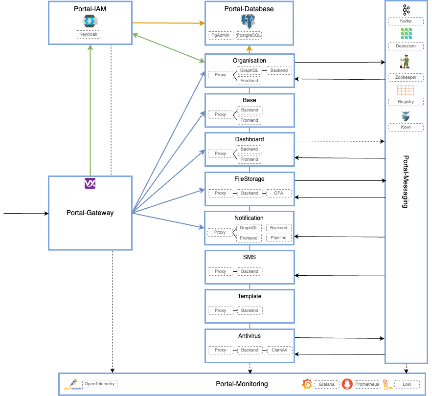
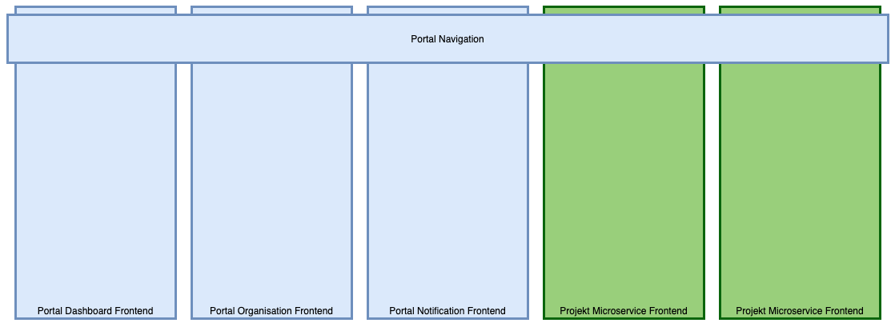

# Über Uniport

## Hintergrund

### Digitalisierung von Unternehmen

Die «Digitalisierung» ist in aller Munde. Doch was bedeutet Digitalisierung? In einer digitalen Welt müssen alle Menschen, die an demselben Prozess beteiligt sind, zusammenarbeiten können. Sie müssen dies so tun können, dass ihre Rolle gemäss ihrer Identität jederzeit klar ist. Akteure und Rollen ändern in der heutigen Zeit laufend. Um dem zu entgegnen, muss die Verwaltung der Akteure und deren Rollen in die Hände derjenigen gegeben werden, die dieses Wissen auch haben. Dadurch werden alle Prozesse deutlich effizienter und weniger fehleranfällig. Alle Tätigkeiten werden chronologisch nachvollziehbar. Mit digitalen Prozessen wollen Endkunden, Vermittler, Verwalter, Lieferanten, Kundenberater und Callcenter Mitarbeiter alle sicher miteinander interagieren können.

Nehmen wir als Beispiel eine Bank. Eine Firma ist ein Kunde, welche ein Firmenkonto bei der Bank hat. Mehrere Mitarbeiter der Firma haben eine Kollektivunterschriftsberechtigung und sind somit berechtigt, auf das Firmenkonto mit Kollektivunterschrift zuzugreifen. Anstatt dass die Firma jeden berechtigten Mitarbeiter der Bank meldet und die Bank diese Mitarbeiter für den digitalen Service hinzufügt und berechtigt, wird nur noch die Firma hinzugefügt und ein Administrator bei der Firma bestimmt. Dieser Administrator verwaltet zukünftig die Mitarbeiter und deren Rollen/Berechtigungen selber.

### Enterprise IT

Die Entwicklung der IT und insbesondere von Unternehmens-IT (Enterprise IT) geht sehr schnell voran. Zwei zentrale Treiber der Enterprise-IT Entwicklung sind die Cloud und die stetig wachsende Anzahl an digitalen Services die den Kunden zur Verfügung gestellt werden.

#### Hin zur Cloud

Aktuell sind die Bestrebungen gross, möglichst alle IT Services in die Cloud zu verschieben. Dies verspricht viele Vorteile wie reduzierte Betriebskosten und viel höhere Skalierbarkeit. IT Services bezieht man in Zukunft wie Wasser oder Strom direkt ab der Steckdose.

Infrastruktur Komponenten wie Docker und Kubernetes oder OpenShift ermöglichen eine effiziente Nutzung solcher Cloud Anbieter. Die Software Entwicklung macht diese Innovationen mit und unterteilt die bisherigen monolithischen Systeme in kleinere, dedizierte Systeme. Dadurch werden eine Vielzahl von Vorteilen erzielt: Die kleineren Services können unabhängig und viel häufiger released werden. Das Ziel ist sogar eine zero-downtime, d.h. kein Unterbruch beim releasen.

#### Viele digitale Angebote

Früher konnten Unternehmen ihren Kunden einen zentralen digitalen Service anbieten. Mittlerweile wächst die Anzahl an digitalen Angeboten aber schnell und stetig. So haben z.B. Banken früher ihren Kunden ein e-Banking mit Zahlungsverkehr und Börsenaufträgen angeboten. Heute stehen sie vor der Herausforderung, den Kunden auch digitales onboarding, digitale Marktplätze, e-Dossier, e-Safe Lösungen u.v.a. anzubieten. Diese können nicht mehr alle selber entwickelt werden, sondern es lohnt sich die Integration von bestehenden Lösungen.

Die Gesamtlösung soll aber ein einheitliches look&feel haben, die einzelnen Lösungen sollen sich nahtlos in ein übergeordnetes Portal integrieren lassen und bestehende Funktionen nutzen.

Es ist offensichtlich, dass sich solche hohen Ziele nur mit einer Modularisierung der bestehenden Infrastruktur erzielen lassen. Nur so kann Wiederverwendbarkeit von existierender Funktionalität erreicht werden. Monolithische Systeme müssen aufgebrochen und modularisiert werden.

## Die Ziele für ein Kundenportal

Diese Entwicklungen und Veränderungen am Markt der Unternehmens-IT sowie unserem 20-jährigen Know-how im Bau von sicheren Kundenlösungen haben uns dazu bewogen, eine Plattform zu erstellen, welche folgende Ziele erreichen soll:

**Modular** Die Plattform wird als Microservice Architektur aufgebaut. Dank der Microservice Architektur ist das gesamte System resp. sogar ganze Eco System sehr modular aufgebaut. Mit dieser Architektur können einzelne Microservices unabhängig von den anderen Microservices aktualisiert werden.

**Offen** Das Wort "offen" resp. "open" wird in der IT sehr häufig missbraucht. Wir verstehen darunter folgendes:

Es können beliebige weitere Microservices in die Lösung integriert werden.

Die Microservices können von beliebigen Anbietern stammen und in einer beliebigen Computersprache implementiert sein. Für die Authentisierung müssen sie sich an den Open ID Connect 2.0 Standard halten. Die Kommunikation mit anderen Microservices erfolgt vorteilhaft über den Datenbus Kafka (lesen und schreiben). Jeder Microservice dokumentiert seine Kafka Datenschnittstelle.

Microservices können Web Components zur Verfügung stellen, welche von anderen Microservices in ihrem UI integriert werden.

Microservices können ausgetauscht werden. Jeder Microservice kann autonom released werden.

**Sicher** Applikatorische Sicherheit ist in der DNA von Inventage. Wir kennen das Thema seit wir e-Banking schreiben, also schon sehr lange. Dieses Fundament wollen wir in Uniport umsetzen. WAF, IAM, feingranularer Datenzugriffsschutz, Datenverschlüsselung, Sonatype IQ: alles spielt zusammen.

**Digitale Kommunikation** Uniport richtet sich nicht nur an Endanwender resp. Kunden der Lösung, sondern bietet auch Funktionalität für Call Center und Kundenberater. Mit der delegierten Benutzerverwaltung können auch ganze Unternehmen an den digitalen Prozessen teilhaben, indem sie die Rollen (und damit die Rechte) ihrer Mitarbeiter auf der Plattform selber verwalten. In einer modernen, digitalen Welt kommunizieren alle diese Akteure digital miteinander.

**Cloud Ready** Die Lösung wurde von Grund auf für die Cloud konzipiert. Sie basiert auf Software, welche den Betrieb und das automatisierte Deployment für die Cloud optimiert hat. Das Ziel ist, die komplette Portal Lösung innert Minuten in einer beliebigen Cloud deployen zu können (Vision).

## Architektur Übersicht

Um die vorgangs erwähnten Ziele mit der Kundenplattform zu erzielen, haben wir uns für eine moderne Microservice Architektur entschieden.

Damit die hohen Erwartungen an die Sicherheit einer Portal Lösung effizient und schnell umgesetzt werden können, müssen die relevanten Sicherheitskomponenten teil der Portal Lösung sein. Nur so ist die Lösung flexibel genug, um sich an den ständig ändernden Business Anforderungen schnell anzupassen. Zu diesen Komponenten zählen wir die Web Application Firewall (WAF) und vor allem das Identity und Access Management System (IAM).

### User Interface

Die Benutzeroberfläche setzt sich aus mehreren [Micro-frontends](https://increment.com/frontend/micro-frontends-in-context/) zusammen.

## Übersicht aller derzeit verfügbaren Uniport Komponenten

Wir unterscheiden bei den Uniport Komponenten zwischen Infrastruktur Komponenten, Microservices und Libraries. Nachfolgende werden nur für den Gateway relevante Komponenten gelistet.

### Infrastruktur Komponenten

#### [Portal-Gateway](./01-introduction/index.md)

Die Portal-Gateway Infrastruktur Komponente dient dem Routing eines Requests zu den jeweiligen Uniport Komponenten.

### Microservices

Es existieren verschiedene Mircroservices, auf welche hier nicht weiter eigegangen wird, da der Fokus auf dem Portal-Gateway liegt. Die folgende Liste soll einen groben Überblich geben:

- Base
- Dashboard
- Organisation
- Conversation
- FileStorage
- Notification
- Template
- Antivirus
- SMS

### Libraries

Da einige Infrastruktur Komponente und Microservice gemeinsamen Code haben, wurde dieser in eine Library ausgelagert.

#### Portal Helm Chart Library

Alle Infrastruktur Komponente und Microservices werden unter Anderem mit Helm in Kubernetes deployed. [Helm](https://helm.sh/) ist der Package Manage für Kubernetes. Mit Helm können Kubernetes Applikationen definiert, versioniert, installiert, upgradet und deinstalliert werden. Im Grunde ist Helm eine Templating Engine für Kubernetes Manifests, die auch gleich die generierten Manifeste in einem Kubernetes Cluster deployen kann. Die Portal Helm Chart Library bietet hier die Möglichkeit Komponente über Helm zu deployen, wobei jeweils nur das Notwendige für ein Deployment konfiguiert werden muss und die Library den Rest übernimmt.
