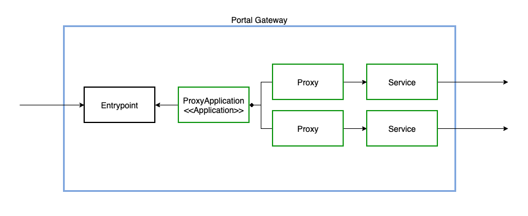

# Portal-Gateway

## Einleitung

Der Portal-Gateway Server agiert als Reverse Proxy für alle Request des Portals.

## Architektur

### Abhängigkeiten zu anderen Uniport Komponenten

## User Interface

## Observability

### Traces

Die Tracing Daten werden zum OpenTelemetry Collector exportiert. Es werden folgende Spans erstellt:

- Span Kind = `server` für eingehende Request/Response
- Span Kind = `client` für ausgehende Request/Response

Falls die `openTelemetry` Middleware Komponente als Entrypoint Middleware konfiguriert ist, so wird in jeder zum Client zurückgegebenen HTTP Antwort der HTTP Header `X-Uniport-Trace-Id` gesetzt. Als Wert ist die OpenTelemetry Trace-Id enthalten.

### Metrics

Für die Bereitstellung der Metriken wird die [Vert.x Micrometer Implementation](https://vertx.io/docs/vertx-micrometer-metrics/java/) verwendet. Sie basiert auf [Micrometer](http://micrometer.io/) und stellt 2 Arten von Metriken zur Verfügung:

- [Vert.x Core](https://vertx.io/docs/vertx-micrometer-metrics/java/#_vert_x_core_tools_metrics)
- [Vert.x Pool](https://vertx.io/docs/vertx-micrometer-metrics/java/#_vert_x_pool_metrics)

### Logs

Die Log Einträge werden via Promtail zum OpenTelemetry Collector exportiert.
