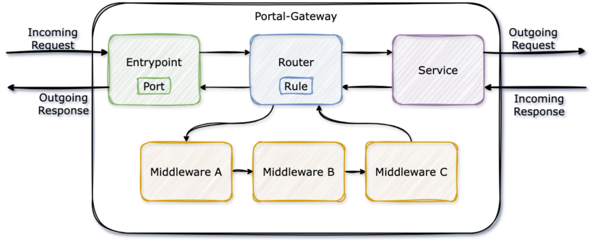

# Introduction

The Uniport-Gateway acts as an reverse proxy for all requests in Uniport.

---

## Overview

The Uniport-Gateway build on top of the concepts of `entrypoints`, `routers`, `middlewares`, `services` and `providers`:

- An `entrypoint` configures the port it is listening on
- A `router` configures a `rule` to route requests, e.g. based on the request's host or path
- A `router` may have `middlewares` to manipulate a request
- A `router` passes the request to a `service` that forward the request to the destination server
- A `provider` reads configuration, e.g. from a file, and provisions the `router`, `middlewares` and `services` accordingly.
