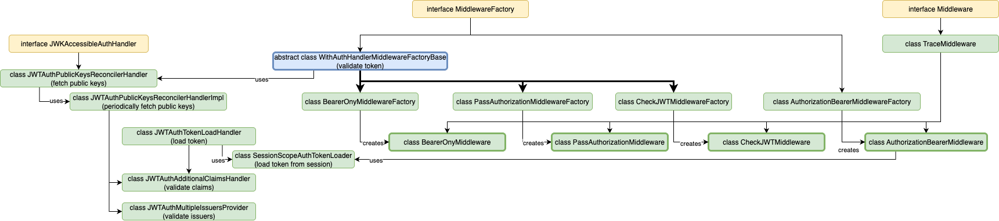

# Extending & Developing

## JSON Schemas for configuration files

Starting with uniport-gateway version `8.0.0`, we provide JSON schemas that can be used to validate your configuration files.

---

### Usage

There are two JSON schemas, `uniportGatewayStaticSchema.json` for the static and `uniportGatewayDynamicSchema.json` for the dynamic configuration file. Both files are included in the following artifact:

```xml
<dependency>
    <groupId>ch.uniport.gateway</groupId>
    <artifactId>config-schemas</artifactId>
    <version>${uniport-gateway.version}</version>
</dependency>
```

You can either manually extract schemas, or use a maven plugin to automate their extraction (for example, `maven-depedency-plugin`).

### Helpful links

- [IntelliJ: Using custom JSON schemas](https://www.jetbrains.com/help/idea/json.html#ws_json_schema_add_custom)
- [About JSON Schemas](https://json-schema.org/)
- [JSON Schema Validator](https://www.jsonschemavalidator.net/)

---

## Code Quality

The Uniport project applies various code quality tools to maintain a clean codebase at all times. The aim is to achieve a consistent format across the entire codebase, adhere to high Java coding standards, and detect bugs through static analysis. To this end, various tools are employed to enable easy integration of code quality tools into the Uniport team's workflow and to automate code quality checks.

The code quality tool settings are managed in a central repository (`code-style-settings`) and pulled in by individual projects.

!!! warning

    The Uniport team must be informed of any changes to the global settings in the central repository.

---

### Formatting

The Eclipse Code Formatter is used for consistent source code formatting. There are plugins available for various IDEs to automatically apply the format:

- IntelliJ: [Adapter for Eclipse Code Formatter](https://plugins.jetbrains.com/plugin/6546-adapter-for-eclipse-code-formatter)
- VSCode: [Redhat Java](https://marketplace.visualstudio.com/items?itemName=redhat.java)

To ensure that source code is automatically formatted with every `mvn install` and can be checked for correct formatting before a commit, the [Spotless Maven Plugin](https://github.com/diffplug/spotless) by diffplug is used. Additionally, this plugin can not only format Java files with the Eclipse Code Formatter but also JSON and Pom files. Furthermore, similar to the well-known `editorconfig`, it can also apply simple formatting (such as indentation, spaces vs. tabs, trimming trailing whitespaces, etc.) to text-based files.

Formatting is applied before each compilation of the source code. By default, only dirty files are formatted and checked. This prevents the entire codebase from showing a diff for a small feature.

!!! tip

    Spotless formatting can be performed manually with `mvn spotless:apply`.

As already mentioned, formatting is checked with every commit. For this, another Maven plugin is used, which installs a Pre-Commit Hook. More on this can be found in the [Pre-Commit Hooks](#pre-commit-hooks) chapter.

!!! tip

    Since each project can contain special files that should not be formatted, or files that are not automatically formatted by the shared configuration, this can be set per project. The configuration of the Spotless Maven Plugin includes `<includes>` and `<excludes>` tags to achieve this exact individual configuration.

??? abstract "Spotless Plugin Configuration"

    The used configuration of the Spotless Maven Plugin:

    ```xml
    <plugin>
        <groupId>com.diffplug.spotless</groupId>
        <artifactId>spotless-maven-plugin</artifactId>
        <version>2.35.0</version>
        <configuration>
            <ratchetFrom>origin/main</ratchetFrom>
            <formats>
                <format>
                    <includes>
                        <include>**/*.md</include>
                        <include>.gitignore</include>
                        <include>.jenkins/Jenkinsfile.build</include>
                    </includes>

                    <trimTrailingWhitespace/>
                    <endWithNewline/>
                    <indent>
                        <spaces>true</spaces>
                        <spacesPerTab>4</spacesPerTab>
                    </indent>
                </format>
            </formats>
            <java>
                <includes>
                    <include>**/src/main/java/**/*.java</include>
                    <include>**/src/test/java/**/*.java</include>
                </includes>

                <importOrder/>
                <removeUnusedImports/>

                <eclipse>
                    <file>${maven.multiModuleProjectDirectory}/.code-style-settings/portal-java-formatter.xml</file>
                </eclipse>
            </java>
            <pom>
                <includes>
                    <include>**/pom.xml</include>
                </includes>
                <sortPom>
                    <nrOfIndentSpace>4</nrOfIndentSpace>
                    <expandEmptyElements>false</expandEmptyElements>
                </sortPom>
            </pom>
            <json>
                <includes>
                    <include>**/*.json</include>
                </includes>

                <gson>
                    <version>2.8.1</version>
                    <indentSpaces>4</indentSpaces>
                    <sortByKeys>false</sortByKeys>
                </gson>
            </json>
        </configuration>
        <executions>
            <execution>
                <goals>
                    <goal>apply</goal>
                </goals>
                <phase>process-sources</phase>
            </execution>
        </executions>
    </plugin>
    ```

---

### Coding Standard

To maintain a high Java Coding Standard, the [Checkstyle Tool](https://checkstyle.org/) is used. Here too, there are plugins available for various IDEs to display suggestions directly in the source code:

- IntelliJ: [Checkstyle-IDEA](https://plugins.jetbrains.com/plugin/1065-checkstyle-idea)
- VSCode: [VSCode Checkstyle](https://marketplace.visualstudio.com/items?itemName=shengchen.vscode-checkstyle)

!!! tip

    Checkstyle checks can be performed manually with `mvn checkstyle:check`.

Here too, a Pre-Commit Hook ensures that no coding standards are violated.

!!! tip

    If there's a desire to ignore individual Checkstyle rules, this can be configured either via the global `suppressions.xml` in the central repository or even per project via `suppressions-specific.xml`.

??? abstract "Checkstyle Plugin Configuration"

    The used configuration of the Checkstyle Maven Plugin:

    ```xml
    <plugin>
        <artifactId>maven-checkstyle-plugin</artifactId>
        <version>3.2.1</version>
        <configuration>
            <consoleOutput>true</consoleOutput>
            <configLocation>${maven.multiModuleProjectDirectory}/.code-style-settings/checkstyle/config.xml</configLocation>
            <suppressionsLocation>${maven.multiModuleProjectDirectory}/.code-style-settings/checkstyle/suppressions.xml</suppressionsLocation>
        </configuration>
        <dependencies>
            <dependency>
                <groupId>com.puppycrawl.tools</groupId>
                <artifactId>checkstyle</artifactId>
                <version>10.7.0</version>
            </dependency>
        </dependencies>
    </plugin>
    ```

---

### Static Analysis for Bug Detection

Static analysis of the source code takes place in the project's build pipeline and is performed by the [Spotbugs Maven Plugin](https://spotbugs.github.io/). The detected bugs are also listed in a separate report, which is available in the build pipeline overview.

??? abstract "Spotbugs Plugin Configuration"

    The used configuration of the Spotbugs Maven Plugin:

    ```xml
    <plugin>
        <groupId>com.github.spotbugs</groupId>
        <artifactId>spotbugs-maven-plugin</artifactId>
        <version>4.7.3.2</version>
        <configuration>
            <failOnError>false</failOnError>
            <xmlOutput>true</xmlOutput>
            <excludeFilterFiles>
                <excludeFilterFile>${maven.multiModuleProjectDirectory}/.code-style-settings/spotbugs/exclude.xml</excludeFilterFile>
                <excludeFilterFile>${maven.multiModuleProjectDirectory}/.code-style-settings/spotbugs/exclude-specific.xml</excludeFilterFile>
            </excludeFilterFiles>
        </configuration>
    </plugin>
    ```

---

### Pre-Commit Hooks

Git Hooks are a local setting and are not pushed upstream. Therefore, a separate plugin is needed here, which in this case installs the Pre-Commit Hooks. The [Git Build Hook Maven Plugin](https://github.com/rudikershaw/git-build-hook) is used, which only expects a path to a file that should be executed as a Pre-Commit Hook. The file is a Bash script and contains only the two commands already discussed in the preceding two sections:

```bash
mvn spotless:check \
    checkstyle:check
```

It should be noted here that when applying the Pre-Commit Hook, committing may take a few seconds longer for the two checks to be executed. Furthermore, it is only possible to commit something if both checks have been successfully completed.

??? abstract "Git Build Hook Plugin Configuration"

    The used configuration of the Git Build Hook Maven Plugin:

    ```xml
    <plugin>
        <groupId>com.rudikershaw.gitbuildhook</groupId>
        <artifactId>git-build-hook-maven-plugin</artifactId>
        <version>3.4.1</version>
        <configuration>
            <installHooks>
                <pre-commit>.code-style-settings/hooks/pre-commit</pre-commit>
                <pre-push>.code-style-settings/hooks/pre-push</pre-push>
            </installHooks>
        </configuration>
        <executions>
            <execution>
                <goals>
                    <goal>install</goal>
                </goals>
                <phase>install</phase>
            </execution>
        </executions>
    </plugin>
    ```

## Authorization

In the `authorization` package, there a multiple middlewares implemented that share functionality:

- `bearerOnly` - validate and check claims of a JWT provided as a bearer token in an authorization header
- `passAuthorization` - validate and check claims of a JWT stored in a session scope, ensuring the authorization header is the same for the incoming request and the outgoing request (required for the Keycloak admin UI)
- `checkJwt` - validate and check claims of a JWT provided in the session scope
- `authorizationBearer` - put a JWT in the authorization header as a bearer token from a session scope

As for all middleware, the have to implement `Middleware` and `MiddlewareFactory` interface. Further, they do not implement `Middleware` directly, but inherit from `TraceMiddleware` for automatic trace span handling per middleware. So far, this is the standard for every middleware.

There are various components shared, such as:

- capability to verify multiple issuers (`JWTAuthMultipleIssuersProvider`)
- capability to verify custom claims (`JWTAuthAdditionalClaimsHandler`)
- (periodically) fetch public keys from the issuer signature verification (`JWTAuthPublicKeysReconcilerHandler`/`Impl`)
- load and store JWTs in the session scope (`SessionScopeAuthTokenLoader`)

To glue that all together, including the config schema and config validation,

- `bearerOnly`, `passAuthorization` and `checkJwt` the middleware factories inherit from `WithAuthHandlerMiddlewareFactoryBase`.
- `authorizationBearer` and `JWTAuthAdditionalClaimsHandler` (via `JWTAuthTokenLoadHandler`) use `SessionScopeAuthTokenLoader`

The following image visualizes how the components are connected. Note that only custom components are shown and Vert.x components are omitted:



## Custom middleware implementations

Custom middleware implementations provided in a additional JAR can be dynamically loaded by the Uniport-Gateway. For this the middleware has to implement the interfaces `MiddlewareFactory`,`MiddlewareOptionsModel` and `Middleware` that are provided as part of the `api` package:

`MiddlewareFactory`: The entrypoint that glues everything together like type, config JSON schema, validation, config model and creation of the middleware. `MiddlewareOptionsModel`: For mapping the validated JSON config onto Java classes aka models. `Middleware`: For the actual middleware implementation handling requests.

The JAR also has to contain a `META-INF/services/ch.uniport.gateway.proxy.middleware.MiddlewareFactory` file with the fully-qualified path to the middleware factory implementation.

See `server/src/test/java/ch/uniport/gateway/proxy/router/additionalRoutes` for a simple example.
