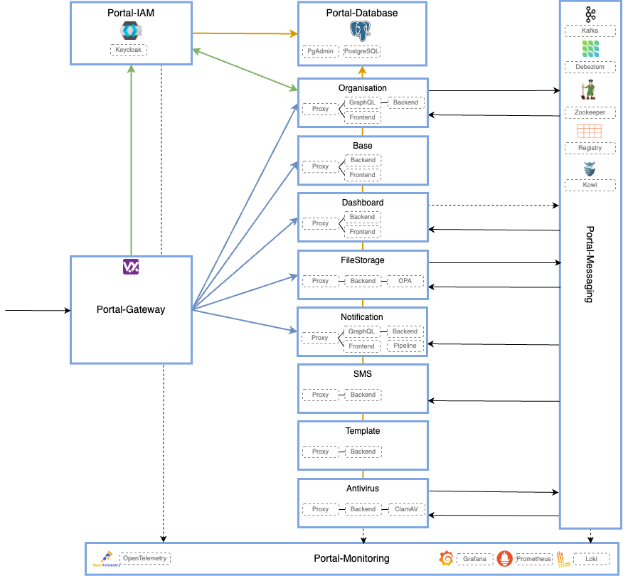
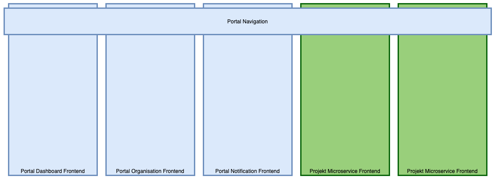

# About Uniport

## Background

### Digitalization of Companies

"Digitalization" is on everyone's lips. But what does digitalization mean? In a digital world, all people involved in the same process must be able to collaborate. They must be able to do so in a way that their role, according to their identity, is clear at all times. Actors and roles are constantly changing in today's world. To counteract this, the management of actors and their roles must be placed in the hands of those who possess this knowledge. This makes all processes significantly more efficient and less prone to errors. All activities become chronologically traceable. With digital processes, end-customers, intermediaries, administrators, suppliers, customer advisors, and call center employees all want to be able to interact securely with each other.

Let's take a bank as an example. A company is a client that has a corporate account with the bank. Several employees of the company have collective signing authority and are thus authorized to access the corporate account with collective signature. Instead of the company notifying the bank of every authorized employee and the bank adding and authorizing these employees for the digital service, only the company is added, and an administrator within the company is designated. This administrator will manage the employees and their roles/permissions themselves in the future.

### Enterprise IT

The development of IT, and particularly Enterprise IT, is progressing very rapidly. Two central drivers of Enterprise IT development are the cloud and the steadily growing number of digital services provided to customers.

#### Towards the Cloud

Currently, there are strong efforts to move as many IT services as possible to the cloud. This promises many advantages such as reduced operating costs and much higher scalability. In the future, IT services will be obtained directly from the socket, like water or electricity.

Infrastructure components like Docker and Kubernetes or OpenShift enable efficient use of such cloud providers. Software development keeps pace with these innovations and divides the previously monolithic systems into smaller, dedicated systems. This achieves a multitude of advantages: the smaller services can be released independently and much more frequently. The goal is even zero-downtime, meaning no interruption during releases.

#### Many Digital Offerings

Previously, companies could offer their customers one central digital service. Meanwhile, the number of digital offerings is growing rapidly and steadily. For example, banks used to offer their customers e-banking with payment transactions and stock market orders. Today, they face the challenge of also offering customers digital onboarding, digital marketplaces, e-dossier, e-safe solutions, and much more. These can no longer all be developed in-house; instead, integrating existing solutions is worthwhile.

However, the overall solution should have a uniform look & feel, and the individual solutions should seamlessly integrate into a overarching portal and utilize existing functions.

It is obvious that such high goals can only be achieved through modularization of the existing infrastructure. Only in this way can reusability of existing functionality be achieved. Monolithic systems must be broken down and modularized.

## The Goals for a Customer Portal

These developments and changes in the enterprise IT market, as well as our 20 years of expertise in building secure customer solutions, have led us to create a platform that aims to achieve the following goals:

**Modular** The platform is built as a Microservice Architecture. Thanks to the Microservice Architecture, the entire system, or even the entire ecosystem, is very modular. With this architecture, individual microservices can be updated independently of other microservices.

**Open** The word "open" is very frequently misused in IT. We understand it to mean the following:

Any further microservices can be integrated into the solution.

The microservices can come from any provider and be implemented in any programming language. For authentication, they must adhere to the Open ID Connect 2.0 standard. Communication with other microservices preferably takes place via the Kafka data bus (reading and writing). Each microservice documents its Kafka data interface.

Microservices can provide Web Components that are integrated by other microservices into their UI.

Microservices can be exchanged. Each microservice can be released autonomously.

**Secure** Application security is in Inventage's DNA. We have known this topic since we started writing e-banking, which is a very long time ago. We want to implement this foundation in Uniport. WAF, IAM, fine-grained data access protection, data encryption, Sonatype IQ: everything works together.

**Digital Communication** Uniport is not only aimed at end-users or customers of the solution but also offers functionality for call centers and customer advisors. With delegated user management, entire companies can participate in digital processes by managing the roles (and thus the rights) of their employees on the platform themselves. In a modern, digital world, all these actors communicate digitally with each other.

**Cloud Ready** The solution was designed from the ground up for the cloud. It is based on software that has optimized operation and automated deployment for the cloud. The goal is to be able to deploy the complete Portal solution in minutes in any cloud (vision).

## Architecture Overview

To achieve the aforementioned goals with the customer platform, we have opted for a modern Microservice Architecture.

To efficiently and quickly implement the high expectations for the security of a Portal solution, the relevant security components must be part of the Portal solution. Only in this way is the solution flexible enough to quickly adapt to constantly changing business requirements. These components include the Web Application Firewall (WAF) and, above all, the Identity and Access Management System (IAM).

### User Interface

The user interface is composed of several [Micro-frontends](https://increment.com/frontend/micro-frontends-in-context/).

## Overview of all currently available Uniport Components

We distinguish between infrastructure components, microservices, and libraries within Uniport components. The following lists only components relevant to the Gateway.

### Infrastructure Components

#### [Portal-Gateway](./01-introduction/index.md)

The Portal-Gateway infrastructure component is responsible for routing requests to the respective Uniport components.

### Microservices

Various microservices exist, which will not be discussed further here, as the focus is on the Portal-Gateway. The following list provides a general overview:

- Base
- Dashboard
- Organisation
- Conversation
- FileStorage
- Notification
- Template
- Antivirus
- SMS

### Libraries

Since some infrastructure components and microservices share common code, it has been outsourced to a library.

#### Portal Helm Chart Library

All infrastructure components and microservices are deployed to Kubernetes, among other methods, using Helm. [Helm](https://helm.sh/) is the package manager for Kubernetes. With Helm, Kubernetes applications can be defined, versioned, installed, upgraded, and uninstalled. Essentially, Helm is a templating engine for Kubernetes Manifests that can also directly deploy the generated manifests to a Kubernetes cluster. The Portal Helm Chart Library offers the possibility to deploy components via Helm, whereby only the necessary information for a deployment needs to be configured, and the library takes care of the rest.
